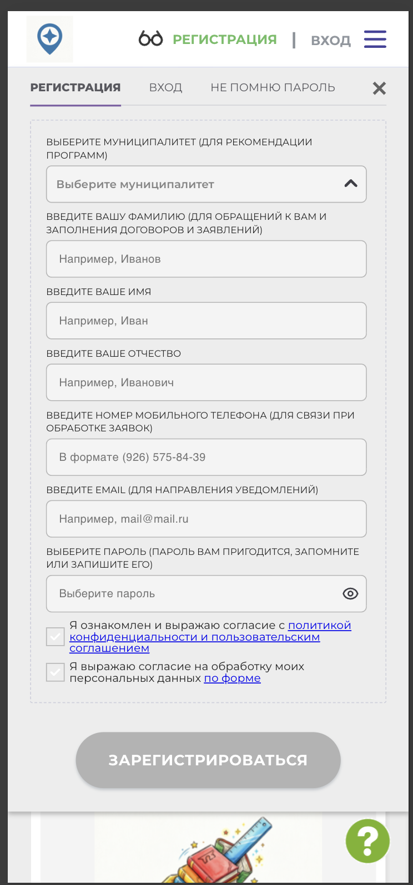
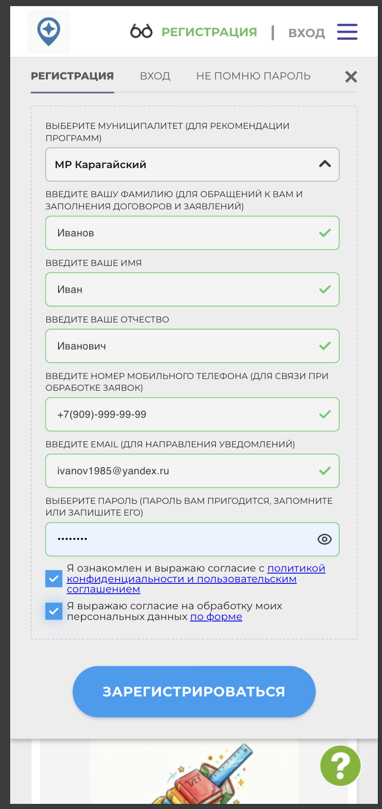

# NAVI2E-001: Сайт. Регистрация. Создание аккаунта с валидными данными

## Описание
Позитивное тестирование регистрации на публичном сайте навигатора дополнительного образования. Mobile First.

## Предусловия
- Пользователь не авторизован на сайте.
- Открыта главная страница публичного сайта.

## Шаги

### Шаг 1
**Действие:**
Нажать кнопку регистрации.

**Ожидаемый результат:**
Открывается форма регистрации. Чекбоксы согласий выключены, кнопка «Зарегистрироваться» неактивна.

### Шаг 2
**Действие:**
Заполнить обязательные поля валидными данными и отметить чекбоксы согласий.

**Ожидаемый результат:**
Кнопка «Зарегистрироваться» становится активной.

### Шаг 3
**Действие:**
Нажать кнопку «Зарегистрироваться».

**Ожидаемый результат:**
Появляется уведомление об успешной регистрации и о том, что на почту отправлено письмо для подтверждения. Пользователь авторизован: в шапке отображается ФИО.

### Шаг 4
**Действие:**
Нажать кнопку «ОК» в уведомлении.

**Ожидаемый результат:**
Уведомление закрывается. Пользователь остаётся на главной странице и остаётся авторизованным.

## Общий ожидаемый результат
Новый пользователь зарегистрирован и авторизован. На почту отправлено письмо для подтверждения адреса.
