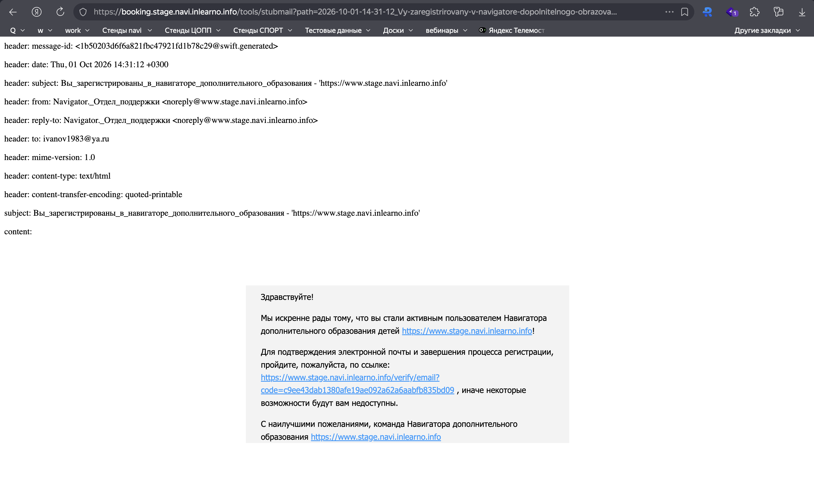
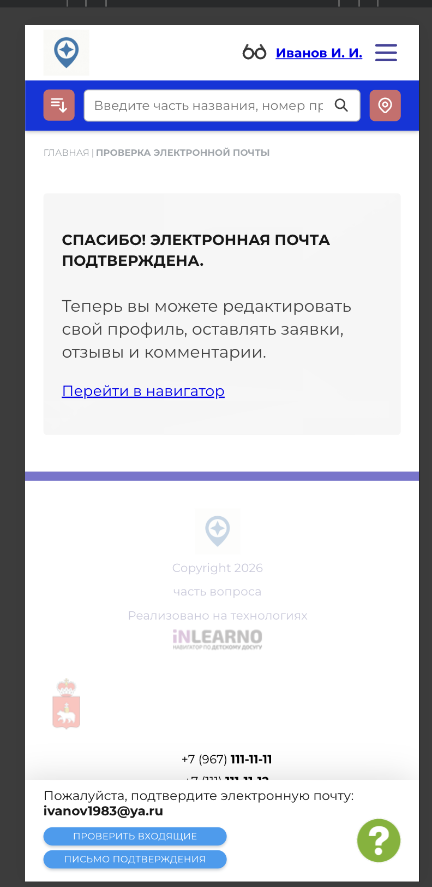

# NAVI2E-003: Сайт. Регистрация. Подтверждение электронной почты

## Описание
Позитивное тестирование подтверждения электронной почты после регистрации на публичном сайте. Mobile First.

## Предусловия
- Пользователь зарегистрирован, электронная почта ещё не подтверждена.
- Письмо со ссылкой подтверждения отправлено и доступно в тестовом почтовом сервисе.

## Шаги

### Шаг 1
**Действие:**
Открыть письмо о регистрации в тестовом почтовом сервисе.

**Ожидаемый результат:**
В письме есть ссылка для подтверждения электронной почты.

### Шаг 2
**Действие:**
Перейти по ссылке подтверждения из письма.

**Ожидаемый результат:**
Открывается страница с сообщением, что электронная почта подтверждена, и ссылкой «Перейти в навигатор».

### Шаг 3
**Действие:**
Нажать ссылку «Перейти в навигатор».

**Ожидаемый результат:**
Открывается главная страница. Пользователь авторизован: в шапке отображается ФИО.

## Общий ожидаемый результат
Электронная почта подтверждена. Пользователь авторизован на главной странице сайта.
