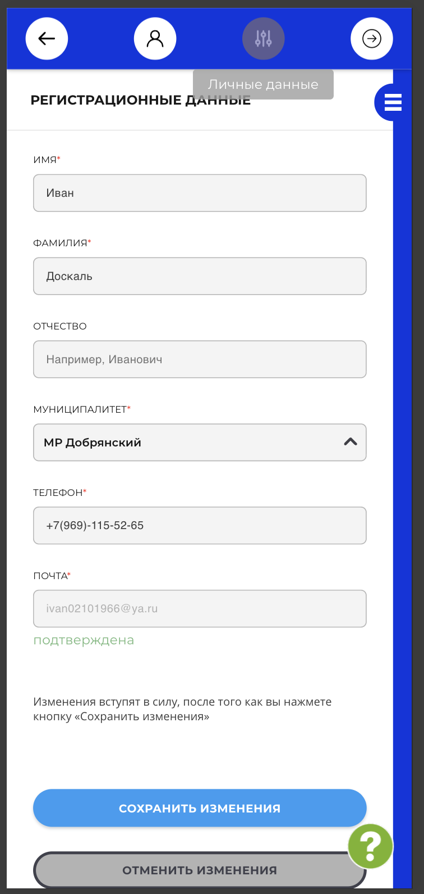
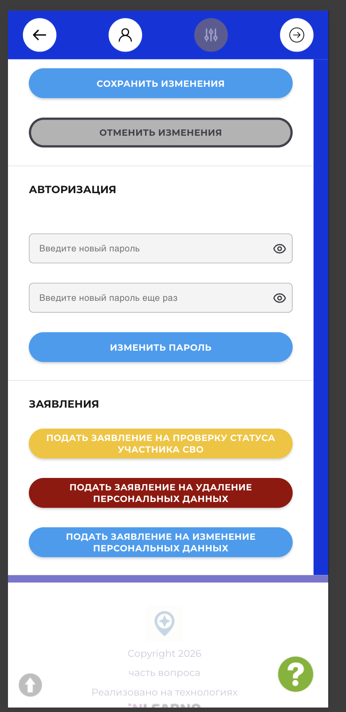

# NAVI2E-004: Сайт. Личный кабинет. Редактирование регистрационных данных

## Описание
Позитивное тестирование сохранения регистрационных данных авторизованного пользователя. Mobile First.

## Предусловия
- Пользователь авторизован на сайте.
- Открыт личный кабинет.

## Шаги

### Шаг 1
**Действие:**
Открыть «Личные данные».

**Ожидаемый результат:**
Открывается форма «Регистрационные данные»: имя, фамилия, отчество, муниципалитет, телефон и почта. Доступны «Сохранить изменения» и «Отменить изменения».

### Шаг 2
**Действие:**
Изменить имя, фамилию и телефон на другие валидные значения.

**Ожидаемый результат:**
Новые значения отображаются в полях.

### Шаг 3
**Действие:**
Нажать «Сохранить изменения».

**Ожидаемый результат:**
Появляется сообщение, что изменения сохранены. В шапке отображается обновлённое ФИО.

### Шаг 4
**Действие:**
Просмотреть блок «Авторизация» ниже формы.

**Ожидаемый результат:**
Доступны поля нового пароля и кнопка «Изменить пароль». Ниже есть заявления на удаление и изменение персональных данных.

## Общий ожидаемый результат
Валидные регистрационные данные сохраняются, и обновлённое ФИО видно в шапке.
