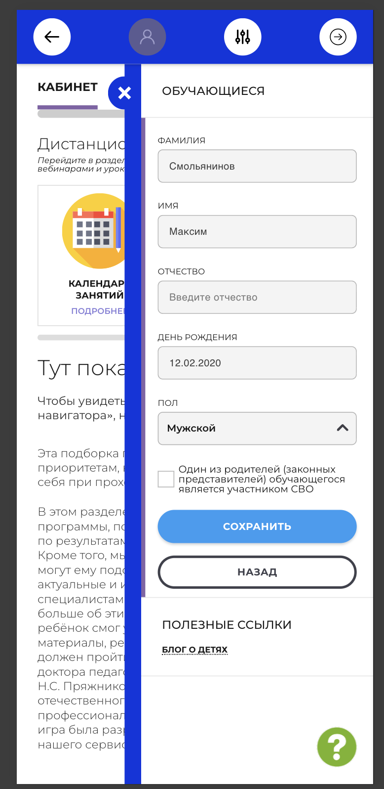

# NAVI2E-005: Сайт. Личный кабинет. Редактирование данных обучающегося

## Описание
Позитивное тестирование изменения данных неподтверждённого профиля обучающегося в личном кабинете. Mobile First.

## Предусловия
- Пользователь авторизован на сайте.
- В кабинете есть неподтверждённый профиль обучающегося: у него отображается значок предупреждения.
- Открыта главная страница публичного сайта.

## Шаги

### Шаг 1
**Действие:**
Нажать на ФИО пользователя в шапке сайта.

**Ожидаемый результат:**
Открывается личный кабинет.

### Шаг 2
**Действие:**
Открыть раздел «Обучающиеся».

**Ожидаемый результат:**
В списке есть неподтверждённый профиль с кнопкой «Изменить данные».

### Шаг 3
**Действие:**
Нажать «Изменить данные» у неподтверждённого профиля.

**Ожидаемый результат:**
Открывается форма с текущими данными профиля. Доступны кнопки «Сохранить» и «Назад».

### Шаг 4
**Действие:**
Изменить фамилию, имя, дату рождения и пол на другие валидные значения.

**Ожидаемый результат:**
Новые значения отображаются в полях формы.

### Шаг 5
**Действие:**
Нажать кнопку «Сохранить».

**Ожидаемый результат:**
На карточке профиля отображаются обновлённые имя и возраст. Иконка соответствует выбранному полу.

## Общий ожидаемый результат
Данные неподтверждённого обучающегося сохранены и отображаются в разделе «Обучающиеся».
