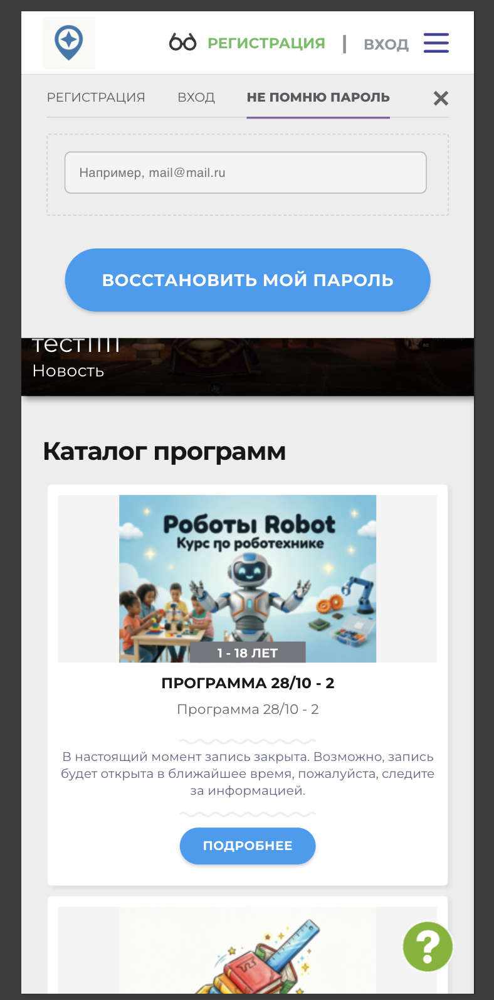
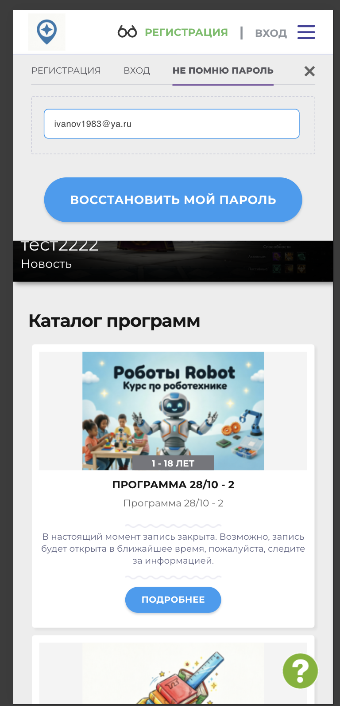
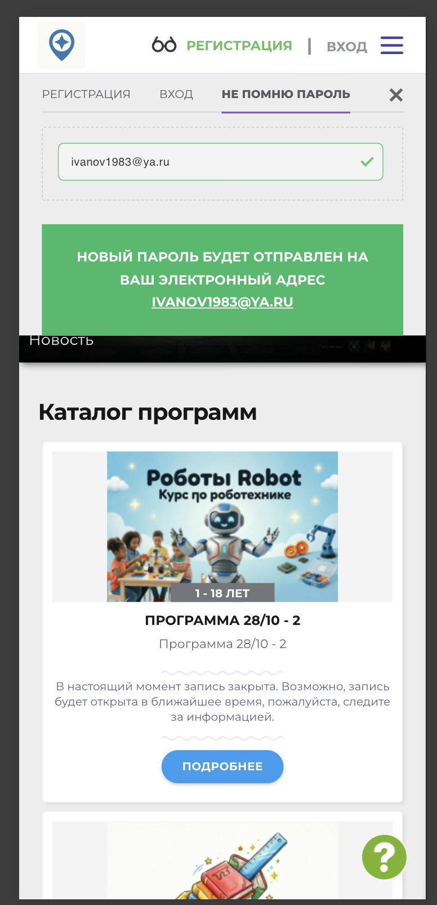
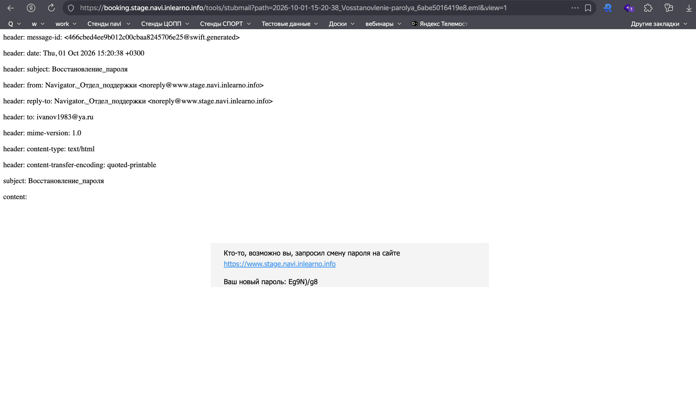
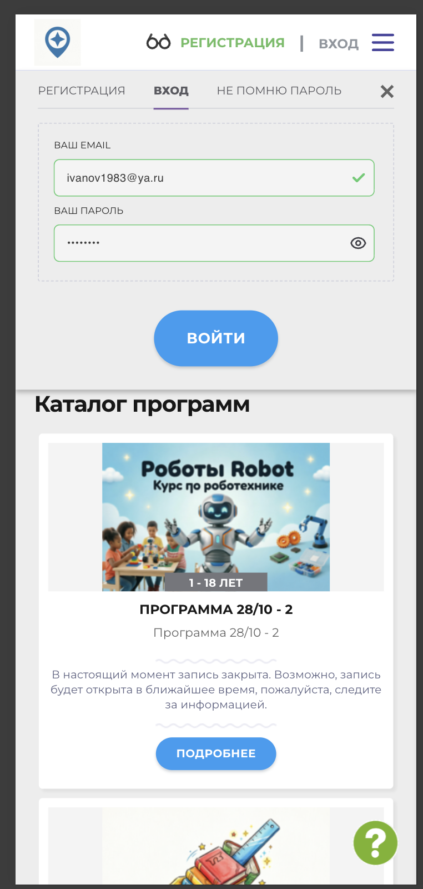
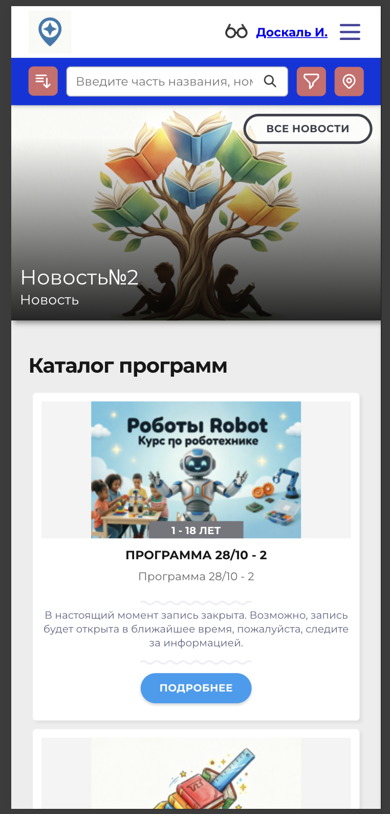

# NAVI2E-006: Сайт. Восстановление пароля

## Описание
Позитивное тестирование восстановления пароля: запрос нового пароля на электронную почту и вход с ним. Mobile First.

## Предусловия
- Есть зарегистрированный аккаунт, известен его email.
- Пользователь не авторизован на сайте.
- Открыта главная страница публичного сайта.
- Доступен тестовый почтовый сервис.

## Шаги

### Шаг 1
**Действие:**
Нажать кнопку входа.

**Ожидаемый результат:**
Открывается окно с вкладками «Регистрация», «Вход» и «Не помню пароль».

### Шаг 2
**Действие:**
Открыть вкладку «Не помню пароль».

**Ожидаемый результат:**
Отображаются поле email и кнопка «Восстановить мой пароль».

### Шаг 3
**Действие:**
Ввести email зарегистрированного пользователя.

**Ожидаемый результат:**
Email отображается в поле.

### Шаг 4
**Действие:**
Нажать кнопку «Восстановить мой пароль».

**Ожидаемый результат:**
Появляется уведомление, что новый пароль будет отправлен на указанный электронный адрес.

### Шаг 5
**Действие:**
Открыть письмо о восстановлении пароля в тестовом почтовом сервисе.

**Ожидаемый результат:**
В письме указан новый пароль.

### Шаг 6
**Действие:**
Открыть вкладку «Вход».

**Ожидаемый результат:**
Отображается форма входа с полями email и пароля.

### Шаг 7
**Действие:**
Ввести email аккаунта и пароль из письма.

**Ожидаемый результат:**
Значения отображаются в полях, кнопка «Войти» доступна.

### Шаг 8
**Действие:**
Нажать кнопку «Войти».

**Ожидаемый результат:**
Пользователь авторизован и находится на главной странице. В шапке отображается ФИО.

## Общий ожидаемый результат
На почту отправлен новый пароль, вход с ним выполняется успешно.
