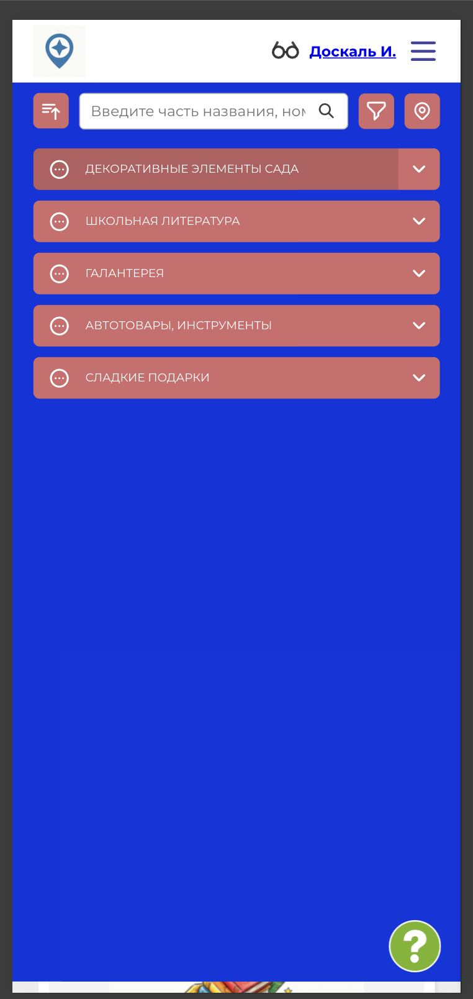
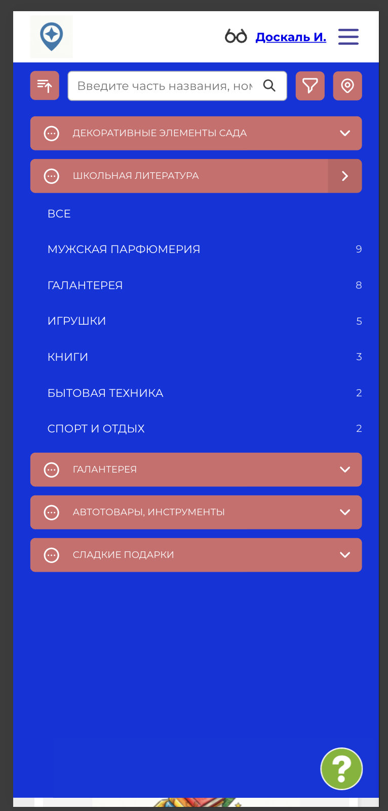
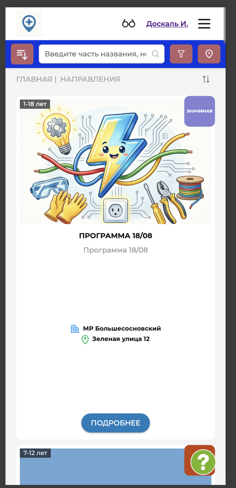

# NAVI2E-007: Сайт. Программы. Поиск через каталог

## Описание
Позитивное тестирование выбора программы через кнопку «Каталог»: направления и направленности. Mobile First.

## Предусловия
- На сайте опубликованы программы разных направлений.
- Открыта главная страница публичного сайта.

## Шаги

### Шаг 1
**Действие:**
Нажать кнопку «Каталог».

**Ожидаемый результат:**
Открывается список направлений.

### Шаг 2
**Действие:**
Раскрыть направление, в котором есть опубликованные программы.

**Ожидаемый результат:**
Отображаются направленности этого направления. Напротив каждой направленности указано количество программ.

### Шаг 3
**Действие:**
Выбрать направленность.

**Ожидаемый результат:**
Открывается список программ выбранной направленности.

### Шаг 4
**Действие:**
Открыть карточку программы из списка.

**Ожидаемый результат:**
Открывается карточка выбранной программы.

## Общий ожидаемый результат
Программа находится через направление и направленность каталога, количество в списке соответствует счётчику направленности.
