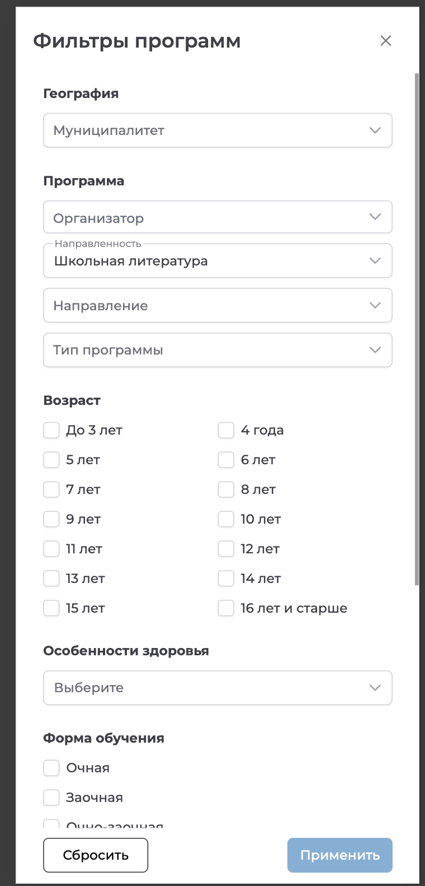
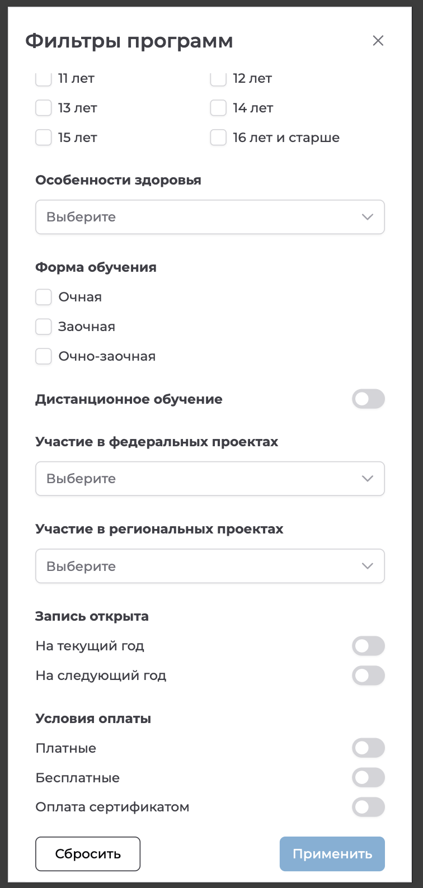

# NAVI2E-008: Сайт. Программы. Фильтрация в каталоге

## Описание
Позитивное тестирование фильтров каталога программ. Mobile First.

## Предусловия
- В каталоге есть опубликованные программы с разным возрастом, направленностью и условиями оплаты.
- Открыт каталог программ на публичном сайте.

## Шаги

### Шаг 1
**Действие:**
Нажать кнопку фильтра.

**Ожидаемый результат:**
Открывается панель «Фильтры программ». Доступны муниципалитет, направленность, возраст и кнопки «Сбросить» и «Применить».

### Шаг 2
**Действие:**
Выбрать возраст, направленность и оплату сертификатом.

**Ожидаемый результат:**
Условия задаются в панели. Доступны также форма обучения и признак открытой записи. Кнопка «Применить» доступна.

### Шаг 3
**Действие:**
Нажать кнопку «Применить».

**Ожидаемый результат:**
В списке остаются программы, которые подходят по всем выбранным условиям.

### Шаг 4
**Действие:**
Нажать кнопку «Сбросить».

**Ожидаемый результат:**
Условия фильтрации сняты. В каталоге снова отображаются опубликованные программы без этих ограничений.

## Общий ожидаемый результат
Фильтры сужают каталог по выбранным условиям и сбрасываются к списку опубликованных программ.
