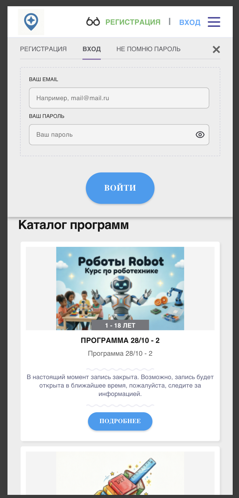
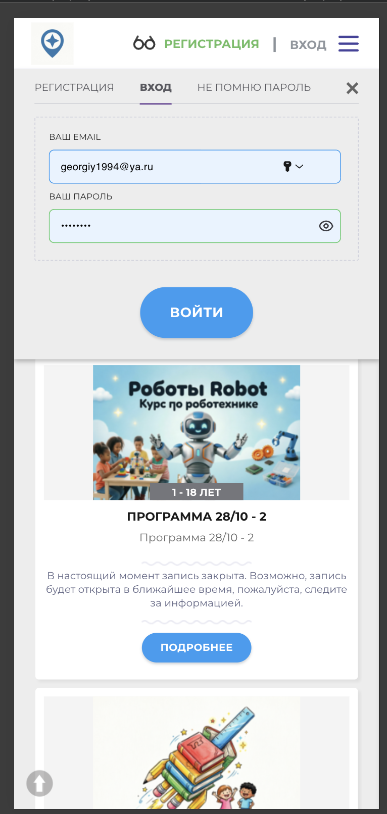

# NAVI2E-009: Сайт. Авторизация. Вход с неверным паролем

## Описание
Негативное тестирование входа на публичный сайт с валидным email и неверным паролем. Mobile First.

## Предусловия
- Есть зарегистрированный аккаунт пользователя.
- Известен валидный email этого аккаунта.
- Пользователь не авторизован на сайте.
- Открыта главная страница публичного сайта.

## Шаги

### Шаг 1
**Действие:**
Нажать кнопку входа.

**Ожидаемый результат:**
Открывается форма входа.

### Шаг 2
**Действие:**
Ввести валидный email и неверный пароль.

**Ожидаемый результат:**
Значения отображаются в полях формы. Кнопка входа доступна.

### Шаг 3
**Действие:**
Нажать кнопку входа.

**Ожидаемый результат:**
Вход не выполняется. Показывается уведомление о неверном email или пароле. Поля подсвечиваются ошибкой. Доступен переход к восстановлению пароля.

## Общий ожидаемый результат
Система отклоняет вход с неверным паролем и остаётся на форме авторизации.
