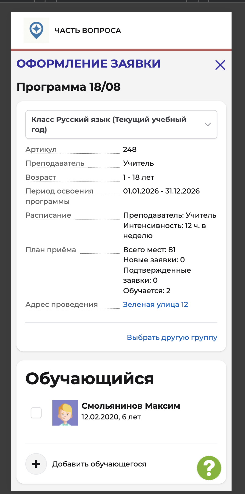
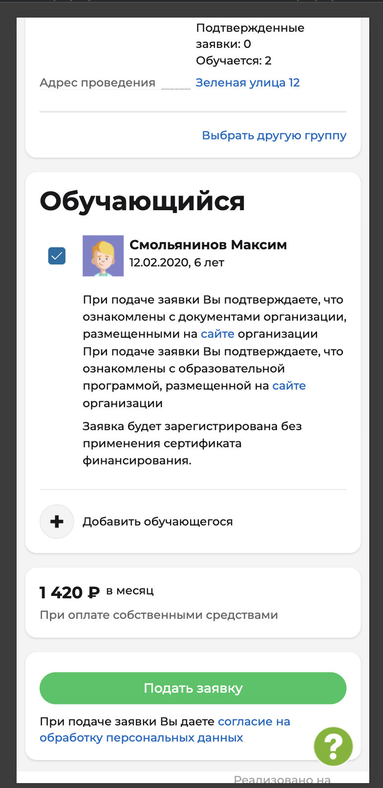
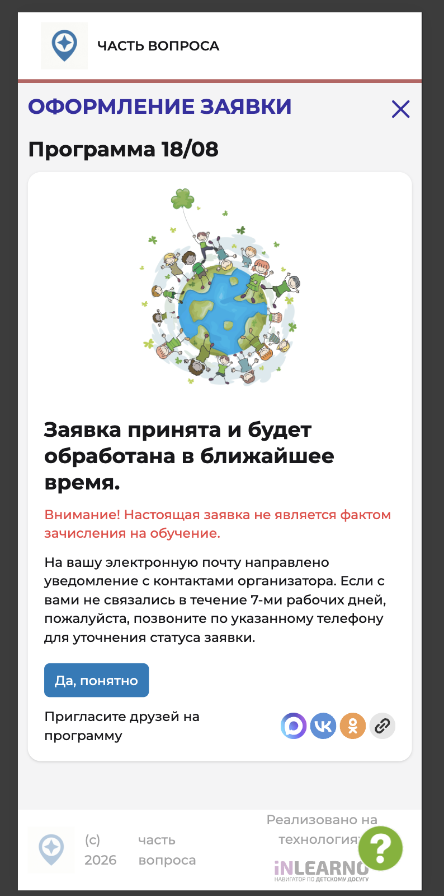

# NAVI2E-039: Сайт. Программы. Подача заявки

## Описание
Позитивное тестирование подачи заявки на программу через публичный сайт: выбор группы или класса, затем запись через Навигатор. Mobile First.

## Предусловия
- Пользователь авторизован, в профиле есть подходящий ребёнок.
- Есть опубликованная программа с группой или классом, открытым приёмом и свободными местами.
- На этого ребёнка заявка в выбранную группу или класс ещё не подавалась.

## Шаги

### Шаг 1
**Действие:**
Открыть карточку программы из предусловий.

**Ожидаемый результат:**
На карточке есть список «Выберите группу» и запись через Навигатор.

### Шаг 2
**Действие:**
В списке «Выберите группу» выбрать группу или класс с открытым приёмом.

**Ожидаемый результат:**
В списке видны артикул, преподаватель, возраст, расписание, адрес и период освоения. Данные карточки соответствуют выбранной группе или классу.

### Шаг 3
**Действие:**
Нажать «Записаться через Навигатор».

**Ожидаемый результат:**
Открывается форма «Оформление заявки»: программа, выбранная группа или класс, параметры обучения и список обучающихся.

### Шаг 4
**Действие:**
Отметить подходящего ребёнка.

**Ожидаемый результат:**
Ребёнок выбран, кнопка «Подать заявку» становится активной.

### Шаг 5
**Действие:**
Нажать «Подать заявку».

**Ожидаемый результат:**
Появляется сообщение, что заявка принята и будет обработана. Есть предупреждение, что заявка не является зачислением, и кнопка «Да, понятно».

### Шаг 6
**Действие:**
Нажать «Да, понятно».

**Ожидаемый результат:**
Пользователь возвращается на карточку той же программы.

## Общий ожидаемый результат
Заявка на выбранную группу или класс принята. После подтверждения пользователь остаётся на карточке программы.
