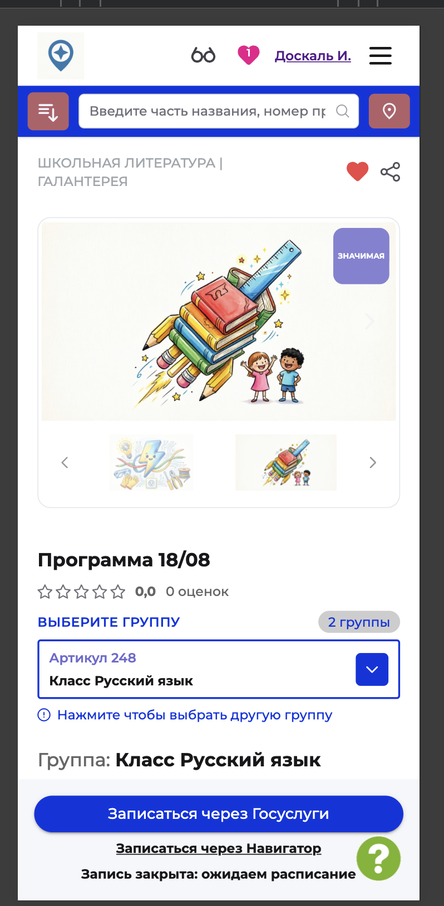
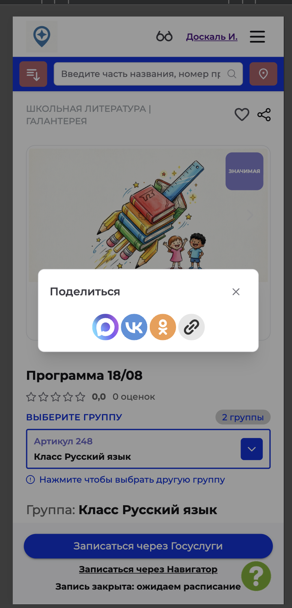

# NAVI2E-040: Сайт. Программа. Поделиться

## Описание
Позитивное тестирование окна «Поделиться» на карточке опубликованной программы. Mobile First.

## Предусловия
- На сайте есть опубликованная программа.
- Открыта карточка этой программы.

## Шаги

### Шаг 1
**Действие:**
Найти на карточке кнопку «Поделиться».

**Ожидаемый результат:**
Кнопка «Поделиться» доступна на карточке.

### Шаг 2
**Действие:**
Нажать «Поделиться».

**Ожидаемый результат:**
Открывается окно «Поделиться» с иконками социальных сетей и копирования ссылки. Окно закрывается крестиком.

## Общий ожидаемый результат
С карточки программы открывается окно, из которого можно поделиться ссылкой на программу.
