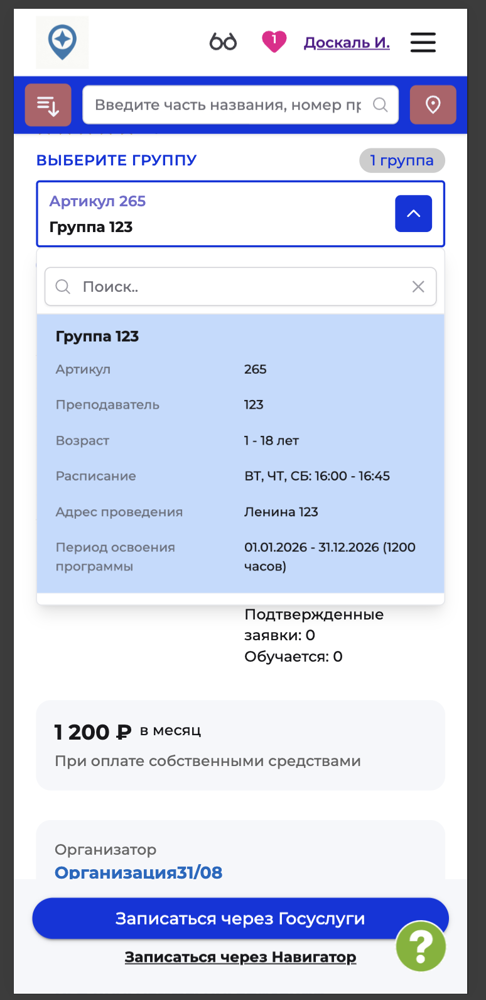
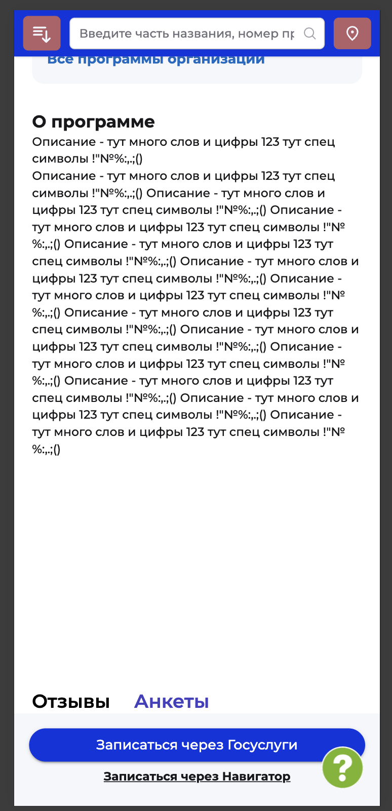

# NAVI2E-042: Сайт. Программа. Описание и данные карточки

## Описание
Позитивное тестирование состава карточки опубликованной программы: группа, параметры и описание. Mobile First.

## Предусловия
- На сайте есть опубликованная программа с заполненным описанием и хотя бы одной группой или классом.
- Открыта карточка этой программы.

## Шаги

### Шаг 1
**Действие:**
Просмотреть верх карточки.

**Ожидаемый результат:**
Отображаются галерея, название программы и запись через Навигатор.

### Шаг 2
**Действие:**
Открыть список «Выберите группу» и выбрать группу или класс.

**Ожидаемый результат:**
В пункте списка видны артикул, преподаватель, возраст, расписание, адрес и период освоения.

### Шаг 3
**Действие:**
Просмотреть параметры карточки после выбора.

**Ожидаемый результат:**
На карточке отображаются данные выбранной группы или класса: артикул, преподаватель, возраст, период, расписание, адрес, форма обучения и план приёма.

### Шаг 4
**Действие:**
Открыть раздел «О программе».

**Ожидаемый результат:**
Отображается текст описания. Ниже доступны разделы «Отзывы» и «Анкеты».

## Общий ожидаемый результат
Карточка показывает данные выбранной группы или класса и текст раздела «О программе».
