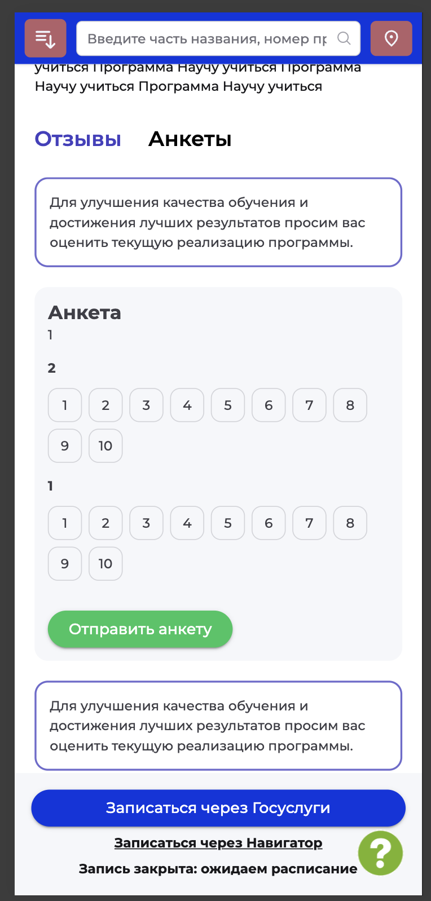
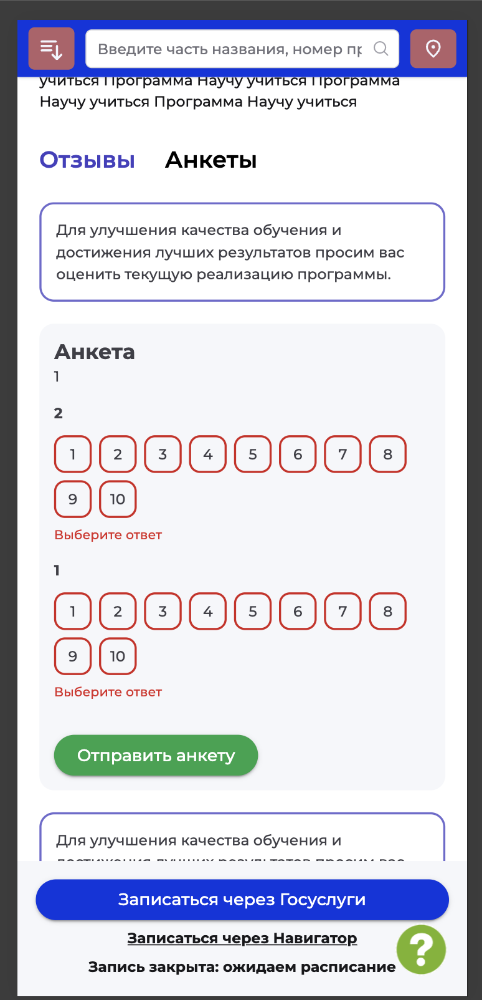
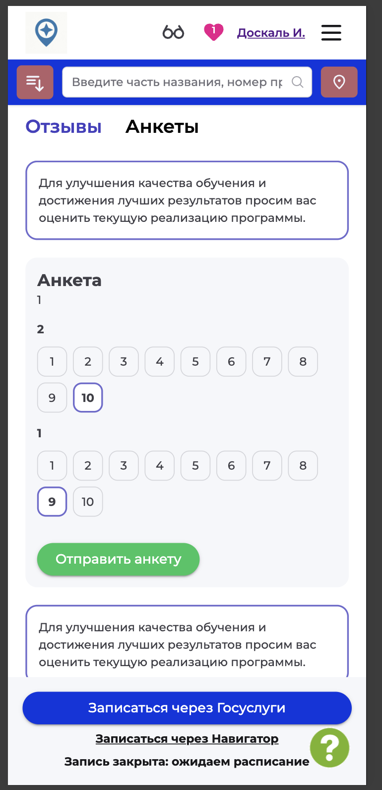
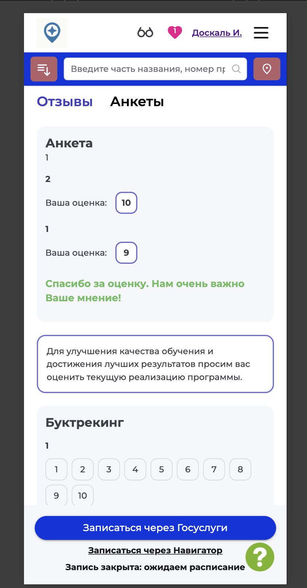

# NAVI2E-045: Сайт. Программа. Анкета оценки качества

## Описание
Позитивное тестирование заполнения анкеты на карточке программы. Mobile First.

## Предусловия
- Пользователь авторизован на сайте.
- У опубликованной программы есть анкета с вопросами по шкале оценок.
- Открыта карточка этой программы.

## Шаги

### Шаг 1
**Действие:**
Открыть раздел «Анкеты».

**Ожидаемый результат:**
Отображается анкета со шкалой оценок и кнопкой «Отправить анкету».

### Шаг 2
**Действие:**
Нажать «Отправить анкету», не выбирая оценки.

**Ожидаемый результат:**
Анкета не отправляется. У вопросов без ответа есть просьба выбрать ответ.

### Шаг 3
**Действие:**
Выбрать оценку для каждого вопроса анкеты.

**Ожидаемый результат:**
Выбранные оценки отмечены, кнопка «Отправить анкету» доступна.

### Шаг 4
**Действие:**
Нажать «Отправить анкету».

**Ожидаемый результат:**
Появляется благодарность за оценку. У отправленной анкеты остаются выбранные оценки, кнопка её повторной отправки скрыта.

## Общий ожидаемый результат
Заполненная анкета принимается. Пустая анкета не отправляется, повторно ту же анкету отправить нельзя.
