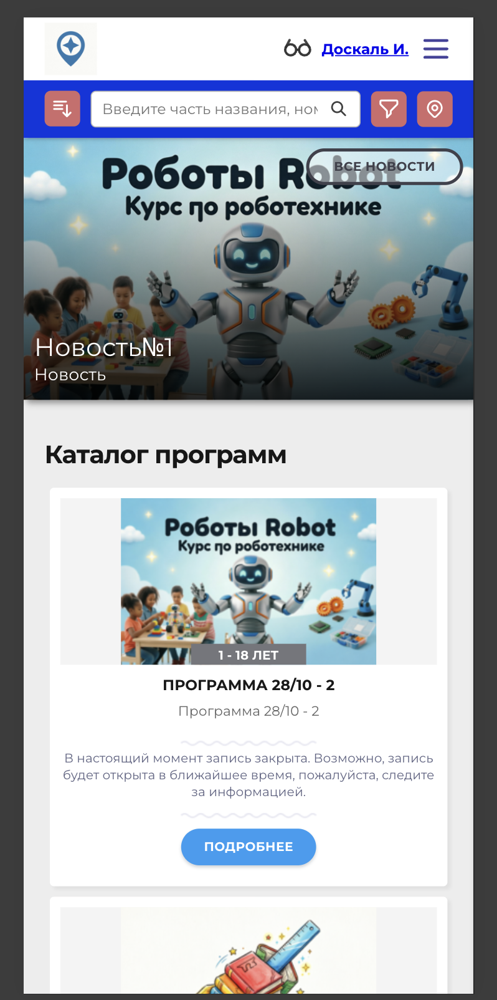
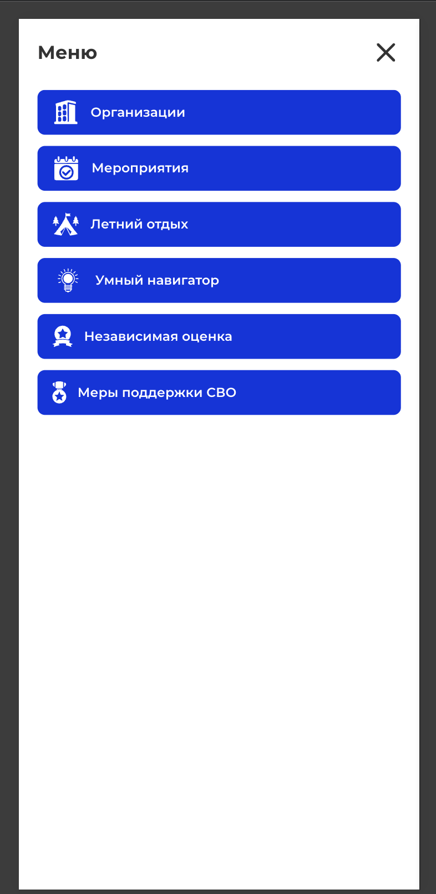
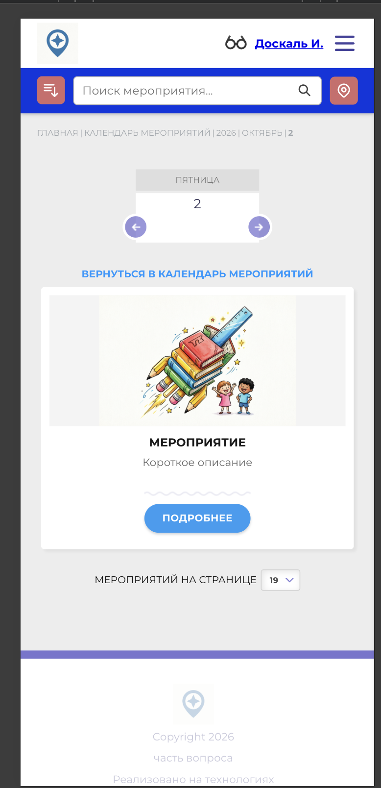

# NAVI2E-193: Сайт. Мероприятия. Календарь

## Описание
Позитивное тестирование календаря мероприятий: текущий месяц, маркировка дат и переход к списку на выбранный день. Mobile First.

## Предусловия
- На сайте есть опубликованные мероприятия на будущую и на прошедшую даты.
- Пользователь находится вне раздела мероприятий.

## Шаги

### Шаг 1
**Действие:**
Открыть главную страницу публичного сайта.

**Ожидаемый результат:**
Отображается главная страница, доступно меню сайта.

### Шаг 2
**Действие:**
Открыть меню сайта.

**Ожидаемый результат:**
В меню есть пункт «Мероприятия».

### Шаг 3
**Действие:**
Нажать «Мероприятия».

**Ожидаемый результат:**
Открывается календарь текущего месяца. Текущий день выделен. У будущих дат с мероприятиями зелёная иконка и количество, у прошедших — красная. Доступны выбор года, месяца и стрелки перехода.

### Шаг 4
**Действие:**
Перейти к другому месяцу стрелкой или списком месяца.

**Ожидаемый результат:**
Календарь показывает выбранный месяц. Селектор месяца и хлебные крошки обновлены.

### Шаг 5
**Действие:**
Нажать день, на который есть будущее опубликованное мероприятие.

**Ожидаемый результат:**
Открывается список мероприятий этой даты. У карточки есть краткое описание и кнопка «Подробнее».

## Общий ожидаемый результат
Календарь показывает опубликованные мероприятия по датам и открывает список на выбранный день.
