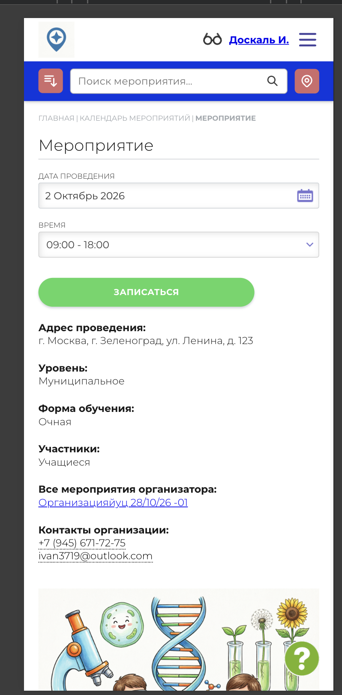

# NAVI2E-196: Сайт. Мероприятия. Похожие мероприятия

## Описание
Позитивное тестирование блока похожих мероприятий на карточке опубликованного мероприятия. Mobile First.

## Предусловия
- Есть опубликованное мероприятие, в том же разделе опубликованы другие мероприятия.
- Открыта карточка этого мероприятия.

## Шаги

### Шаг 1
**Действие:**
Просмотреть блок похожих мероприятий.

**Ожидаемый результат:**
В блоке есть другие опубликованные мероприятия того же раздела. Текущее мероприятие в блоке не повторяется.

### Шаг 2
**Действие:**
Открыть одно похожее мероприятие.

**Ожидаемый результат:**
Открывается карточка выбранного мероприятия.

## Общий ожидаемый результат
С карточки мероприятия можно перейти к другому опубликованному мероприятию того же раздела.
