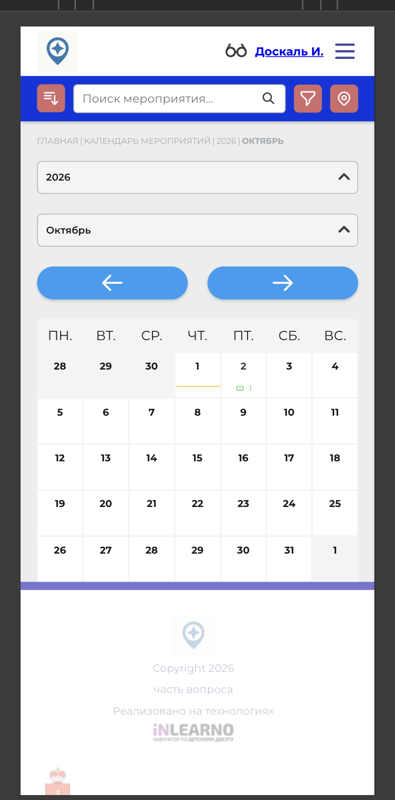

# NAVI2E-198: Сайт. Мероприятия. Поиск

## Описание
Позитивное тестирование поиска опубликованного мероприятия по части названия. Mobile First.

## Предусловия
- На сайте есть опубликованное мероприятие, известно его название.
- Открыт календарь мероприятий.

## Шаги

### Шаг 1
**Действие:**
Найти строку поиска мероприятий.

**Ожидаемый результат:**
Строка поиска доступна на странице календаря.

### Шаг 2
**Действие:**
Ввести часть названия опубликованного мероприятия без учёта регистра и выполнить поиск.

**Ожидаемый результат:**
В результатах есть это мероприятие.

### Шаг 3
**Действие:**
Открыть найденное мероприятие.

**Ожидаемый результат:**
Открывается карточка этого мероприятия.

## Общий ожидаемый результат
Поиск по части названия находит опубликованное мероприятие независимо от регистра и открывает его карточку.
