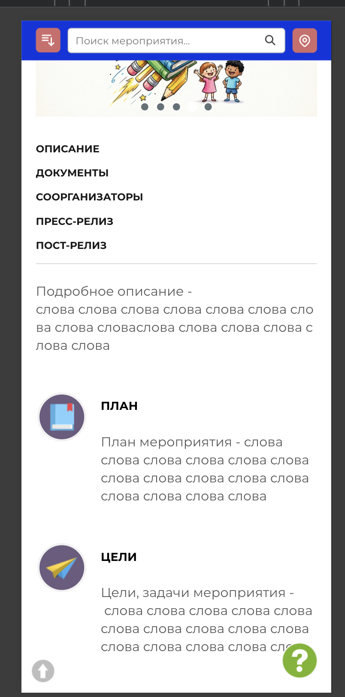
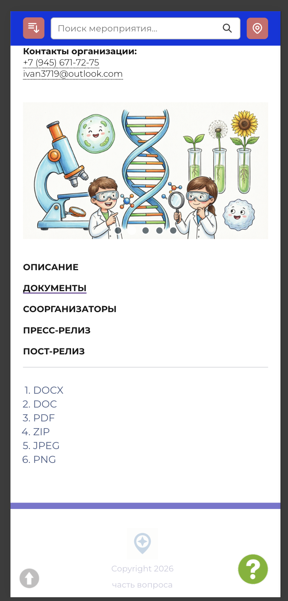
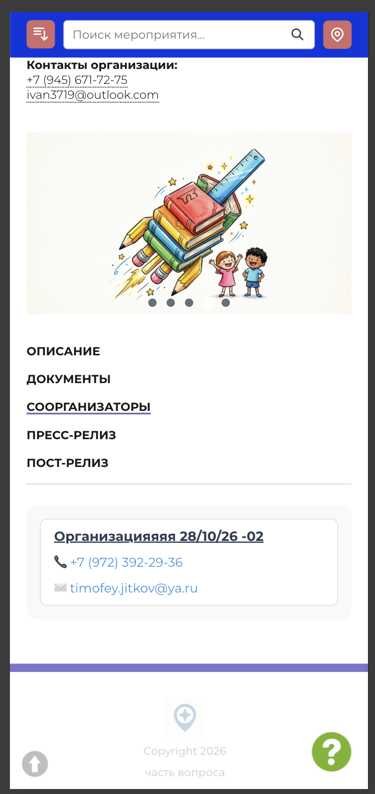
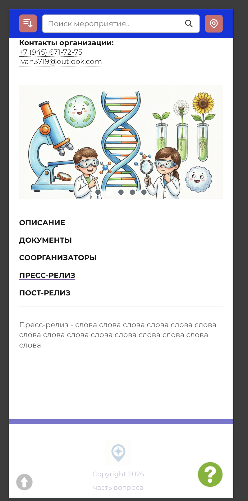
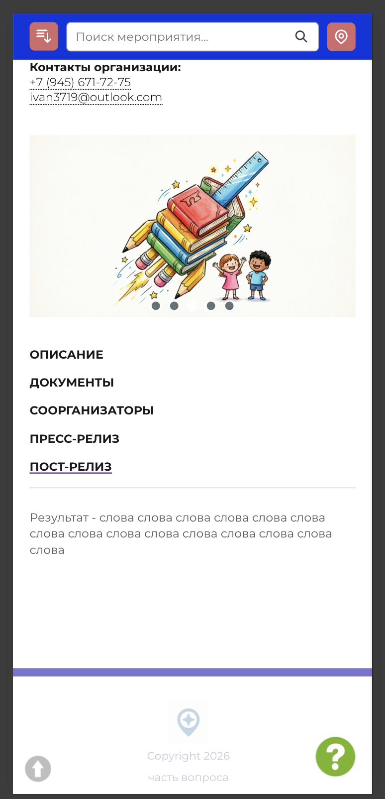

# NAVI2E-199: Сайт. Мероприятия. Карточка

## Описание
Позитивное тестирование карточки опубликованного мероприятия. Mobile First.

## Предусловия
- На сайте есть опубликованное мероприятие с заполненными описанием, документами и параметрами проведения.
- Открыт список мероприятий на дату его проведения.

## Шаги

### Шаг 1
**Действие:**
Нажать «Подробнее» на карточке мероприятия.

**Ожидаемый результат:**
Открывается карточка: название, дата, время, кнопка «Записаться», адрес, уровень, форма обучения, участники, ссылка на мероприятия организатора и контакты организации.

### Шаг 2
**Действие:**
Открыть раздел «Описание».

**Ожидаемый результат:**
Отображается описание мероприятия и заполненные подразделы, в том числе план и цели.

### Шаг 3
**Действие:**
Открыть раздел «Документы».

**Ожидаемый результат:**
Отображается список документов мероприятия.

### Шаг 4
**Действие:**
Открыть раздел «Соорганизаторы».

**Ожидаемый результат:**
Отображаются данные соорганизатора мероприятия.

### Шаг 5
**Действие:**
Открыть раздел «Пресс-релиз».

**Ожидаемый результат:**
Отображается пресс-релиз мероприятия.

### Шаг 6
**Действие:**
Открыть раздел «Пост-релиз».

**Ожидаемый результат:**
Отображается пост-релиз мероприятия.

## Общий ожидаемый результат
Карточка показывает параметры проведения и содержимое разделов описания, документов, соорганизаторов, пресс-релиза и пост-релиза.
