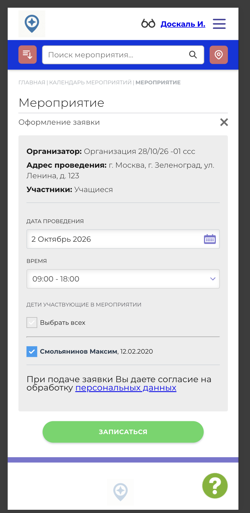
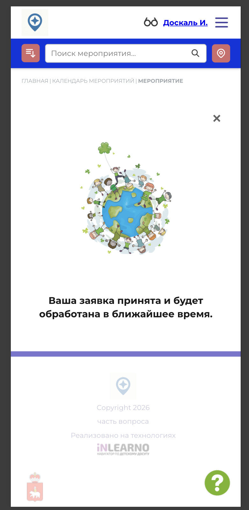

# NAVI2E-200: Сайт. Мероприятия. Подача заявки

## Описание
Позитивное тестирование записи на опубликованное мероприятие. Mobile First.

## Предусловия
- Пользователь авторизован, в профиле есть ребёнок.
- Есть опубликованное мероприятие на будущую дату с открытой записью.
- Открыта карточка этого мероприятия.

## Шаги

### Шаг 1
**Действие:**
Нажать кнопку «Записаться».

**Ожидаемый результат:**
Открывается форма «Оформление заявки»: организатор, адрес, участники, дата, время и список детей.

### Шаг 2
**Действие:**
Отметить подходящего ребёнка.

**Ожидаемый результат:**
Ребёнок выбран, кнопка «Записаться» доступна.

### Шаг 3
**Действие:**
Нажать кнопку «Записаться».

**Ожидаемый результат:**
Появляется сообщение, что заявка принята и будет обработана.

### Шаг 4
**Действие:**
Закрыть уведомление.

**Ожидаемый результат:**
Пользователь возвращается на карточку мероприятия.

## Общий ожидаемый результат
Заявка на мероприятие принята, пользователь видит подтверждение и остаётся на карточке мероприятия.
