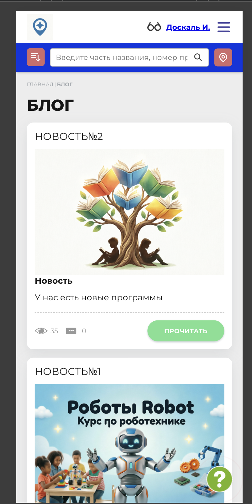
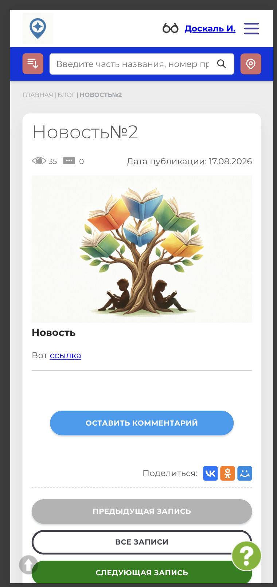

# NAVI2E-423: Сайт. Блог. Просмотр записи

## Описание
Позитивное тестирование открытия опубликованной записи блога с публичного сайта. Mobile First.

## Предусловия
- На сайте есть опубликованная запись блога.
- Открыта главная страница публичного сайта.

## Шаги

### Шаг 1
**Действие:**
Найти в блоке новостей кнопку «Все новости».

**Ожидаемый результат:**
Кнопка «Все новости» доступна.

### Шаг 2
**Действие:**
Нажать «Все новости».

**Ожидаемый результат:**
Открывается раздел «Блог» со списком записей. У записи есть кнопка «Прочитать».

### Шаг 3
**Действие:**
Нажать «Прочитать» у опубликованной записи.

**Ожидаемый результат:**
Открывается запись: заголовок, дата публикации и текст. Доступны комментарий к записи и переход к другим записям.

## Общий ожидаемый результат
Опубликованная запись блога открывается из списка и показывает заголовок, дату и текст.
