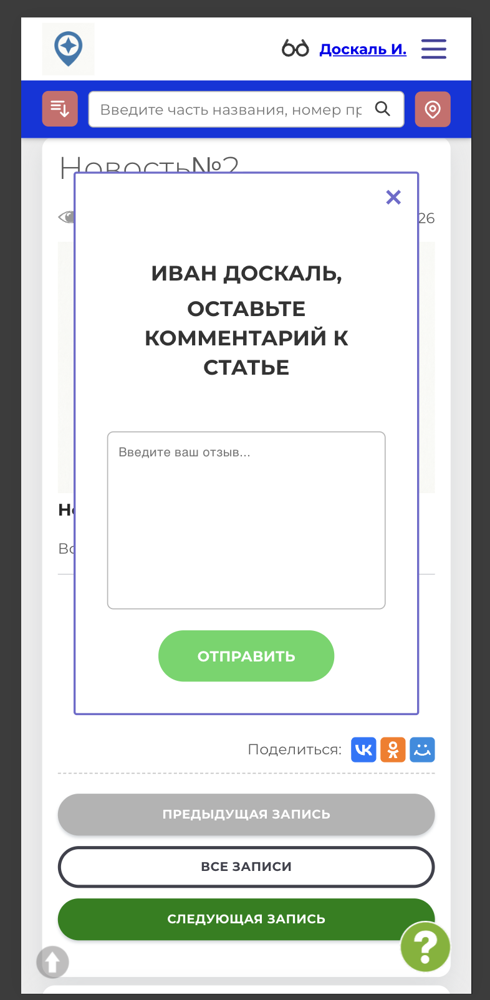
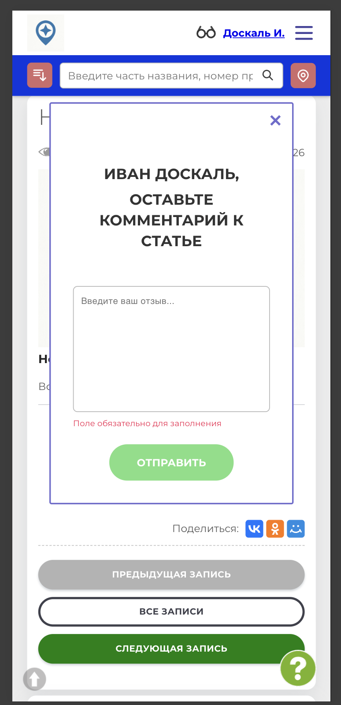
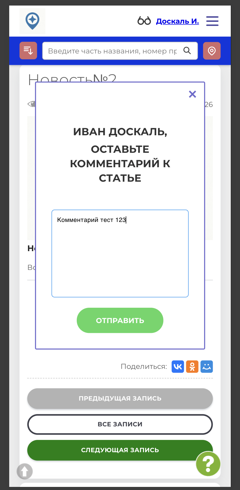
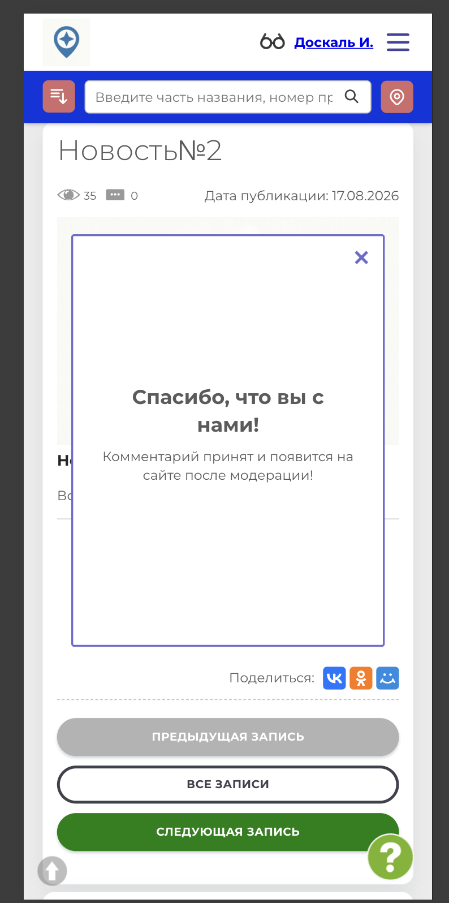

# NAVI2E-424: Сайт. Блог. Комментарий к записи

## Описание
Позитивное тестирование отправки комментария к опубликованной записи блога. Mobile First.

## Предусловия
- Пользователь авторизован на сайте.
- Открыта опубликованная запись блога, у которой можно оставить комментарий.

## Шаги

### Шаг 1
**Действие:**
Нажать «Оставить комментарий».

**Ожидаемый результат:**
Открывается форма комментария с полем текста и кнопкой «Отправить».

### Шаг 2
**Действие:**
Нажать «Отправить», не заполняя текст.

**Ожидаемый результат:**
Комментарий не отправляется. Под полем показано, что его нужно заполнить.

### Шаг 3
**Действие:**
Ввести текст комментария.

**Ожидаемый результат:**
Текст отображается в поле, кнопка «Отправить» доступна.

### Шаг 4
**Действие:**
Нажать «Отправить».

**Ожидаемый результат:**
Появляется сообщение, что комментарий принят и появится на сайте после модерации.

## Общий ожидаемый результат
Комментарий с текстом принят и ожидает модерации. Пустая форма не отправляется.
