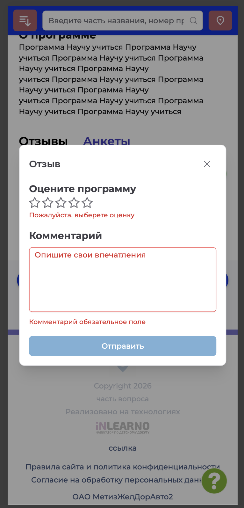
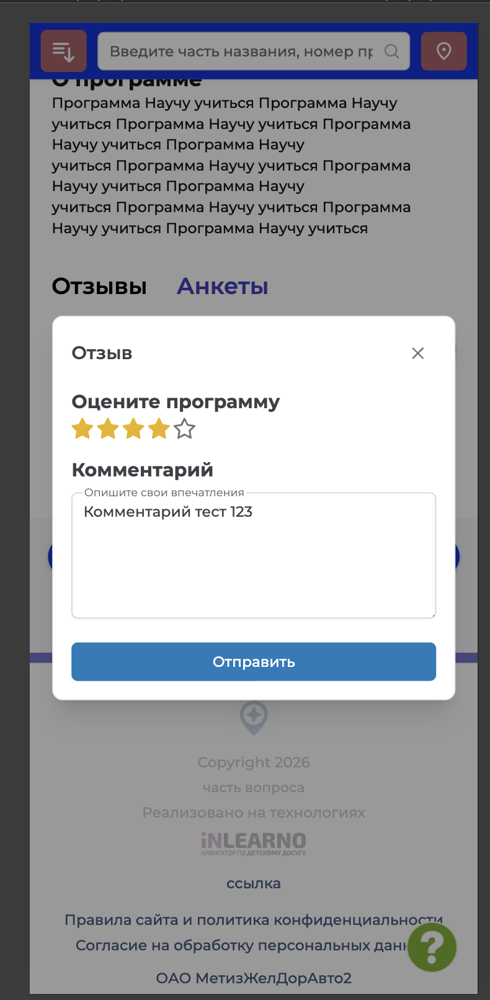
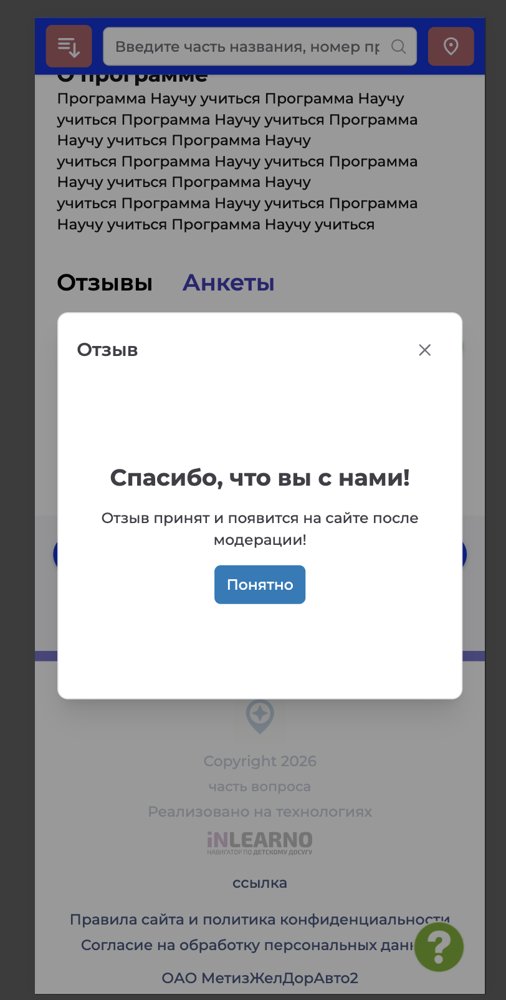

# NAVI2E-442: Сайт. Программа. Отзыв

## Описание
Позитивное тестирование отправки отзыва на программу, на которой обучается ребёнок пользователя. Mobile First.

## Предусловия
- Пользователь авторизован на сайте.
- Ребёнок пользователя обучается на опубликованной программе.
- Открыта карточка этой программы.

## Шаги

### Шаг 1
**Действие:**
Открыть раздел «Отзывы».

**Ожидаемый результат:**
Отображаются рейтинг программы и кнопка «Написать отзыв».

### Шаг 2
**Действие:**
Нажать «Написать отзыв».

**Ожидаемый результат:**
Открывается форма «Отзыв»: оценка программы, комментарий и кнопка «Отправить».

### Шаг 3
**Действие:**
Нажать «Отправить», не выбирая оценку и не заполняя комментарий.

**Ожидаемый результат:**
Отзыв не отправляется. Форма просит выбрать оценку и заполнить комментарий.

### Шаг 4
**Действие:**
Выбрать оценку и ввести текст комментария.

**Ожидаемый результат:**
Оценка и текст отображаются в форме, кнопка «Отправить» доступна.

### Шаг 5
**Действие:**
Нажать «Отправить».

**Ожидаемый результат:**
Появляется сообщение, что отзыв принят и появится на сайте после модерации. Доступна кнопка «Понятно».

## Общий ожидаемый результат
Отзыв с оценкой и комментарием принят и ожидает модерации. Форма без оценки и текста не отправляется.
