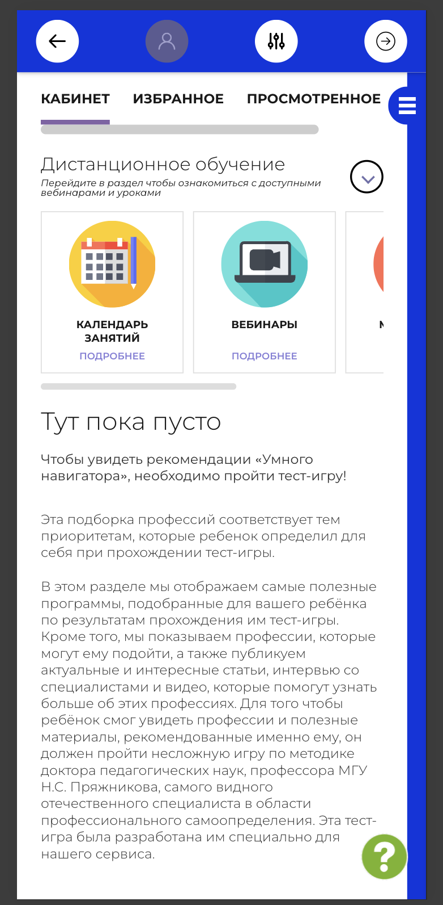
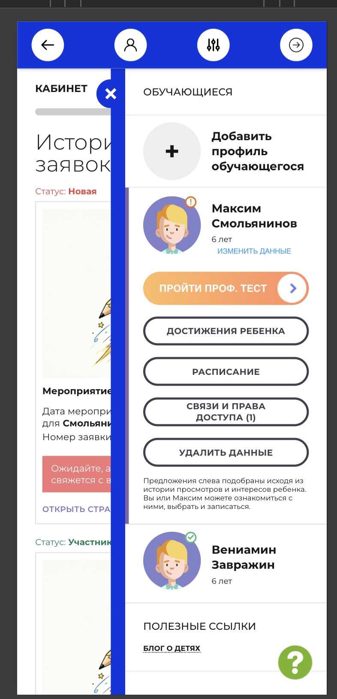

# NAVI2E-727: Сайт. Личный кабинет. Умный навигатор

## Описание
Позитивное тестирование доступа к профтесту умного навигатора после добавления ребёнка. Mobile First.

## Предусловия
- Пользователь авторизован на сайте.
- В профиле пока нет обучающегося.
- Открыт личный кабинет.

## Шаги

### Шаг 1
**Действие:**
Открыть раздел «Кабинет».

**Ожидаемый результат:**
Рекомендации умного навигатора не показаны. На странице указано, что для них нужно пройти тест-игру.

### Шаг 2
**Действие:**
Добавить профиль обучающегося с валидными данными.

**Ожидаемый результат:**
В разделе «Обучающиеся» появляется профиль ребёнка и кнопка «Пройти проф. тест».

### Шаг 3
**Действие:**
Нажать «Пройти проф. тест».

**Ожидаемый результат:**
Открывается тест умного навигатора для этого ребёнка.

## Общий ожидаемый результат
После добавления ребёнка в кабинете доступен его профтест. Без ребёнка рекомендации умного навигатора не выводятся.
