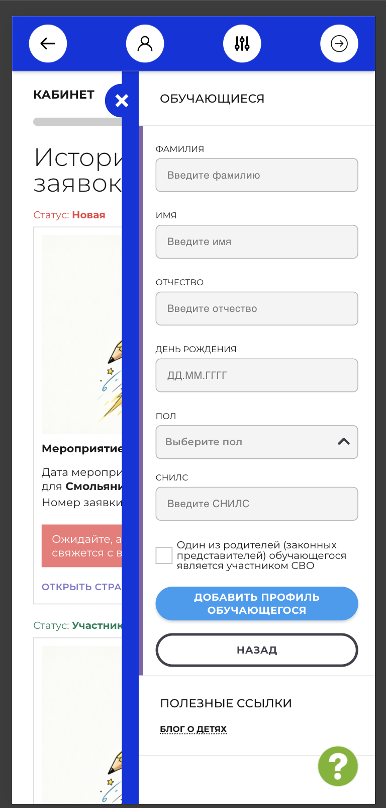

# NAVI2E-745: Сайт. Личный кабинет. Дубль ребёнка с тем же СНИЛС

## Описание
Негативное тестирование создания второго профиля обучающегося с СНИЛС, который уже есть у ребёнка. Mobile First.

## Предусловия
- Пользователь авторизован на сайте.
- В системе уже есть ребёнок с заполненным СНИЛС.
- Известен этот СНИЛС.
- Открыта форма добавления профиля обучающегося.

## Шаги

### Шаг 1
**Действие:**
Заполнить обязательные поля валидными данными и указать СНИЛС уже существующего ребёнка.

**Ожидаемый результат:**
Значения отображаются в форме. Кнопка «Добавить профиль обучающегося» доступна для нажатия.

### Шаг 2
**Действие:**
Нажать «Добавить профиль обучающегося».

**Ожидаемый результат:**
Второй профиль не создаётся. Система предупреждает, что ребёнок с таким СНИЛС уже есть.

### Шаг 3
**Действие:**
Вернуться к списку обучающихся и найти ребёнка по этому СНИЛС.

**Ожидаемый результат:**
В списке один профиль с этим СНИЛС.

## Общий ожидаемый результат
Повторный СНИЛС не создаёт второго профиля обучающегося.
