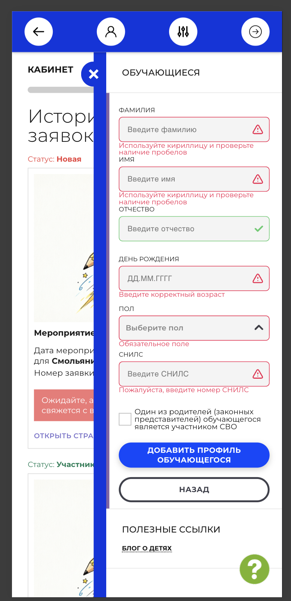

# NAVI2E-746: Сайт. Личный кабинет. Валидация СНИЛС и даты рождения

## Описание
Негативное тестирование формы обучающегося: неверный СНИЛС и недопустимая дата рождения. Mobile First.

## Предусловия
- Пользователь авторизован на сайте.
- Открыта форма добавления профиля обучающегося.
- Остальные обязательные поля заполнены валидными данными.

## Шаги

### Шаг 1
**Действие:**
Ввести СНИЛС с неверной контрольной суммой и нажать «Добавить профиль обучающегося».

**Ожидаемый результат:**
Профиль не создаётся. Поле СНИЛС подсвечено ошибкой.

### Шаг 2
**Действие:**
Ввести в СНИЛС буквы или номер короче маски и снова нажать кнопку добавления.

**Ожидаемый результат:**
Профиль не создаётся. Поле не принимает значение либо показывает ошибку формата.

### Шаг 3
**Действие:**
Указать дату рождения в будущем и нажать кнопку добавления.

**Ожидаемый результат:**
Профиль не создаётся. Под датой рождения показано «Введите корректный возраст».

### Шаг 4
**Действие:**
Указать дату рождения, при которой возраст выходит за допустимый диапазон, и нажать кнопку добавления.

**Ожидаемый результат:**
Профиль не создаётся. Под датой рождения показано «Введите корректный возраст».

## Общий ожидаемый результат
Форма не сохраняет обучающегося с неверным СНИЛС, датой в будущем или возрастом вне допустимого диапазона.
