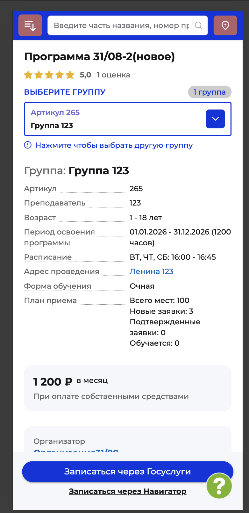

# NAVI2E-851: Сайт. Программа. Обновление расписания

## Описание
Проверка, что изменённое в админке расписание группы видно на карточке программы. Mobile First.

## Предусловия
- Есть опубликованная программа с группой, у которой заполнено расписание.
- Известны дни и время занятий до изменения.

## Шаги

### Шаг 1
**Действие:**
В админке изменить дни или время расписания этой группы и сохранить.

**Ожидаемый результат:**
Новое расписание сохранено.

### Шаг 2
**Действие:**
Обновить карточку программы на публичном сайте и открыть параметры этой группы.

**Ожидаемый результат:**
В блоке расписания отображаются сохранённые дни и время. Период освоения остаётся прежним.

## Общий ожидаемый результат
После сохранения в админке карточка программы показывает обновлённое расписание группы.
