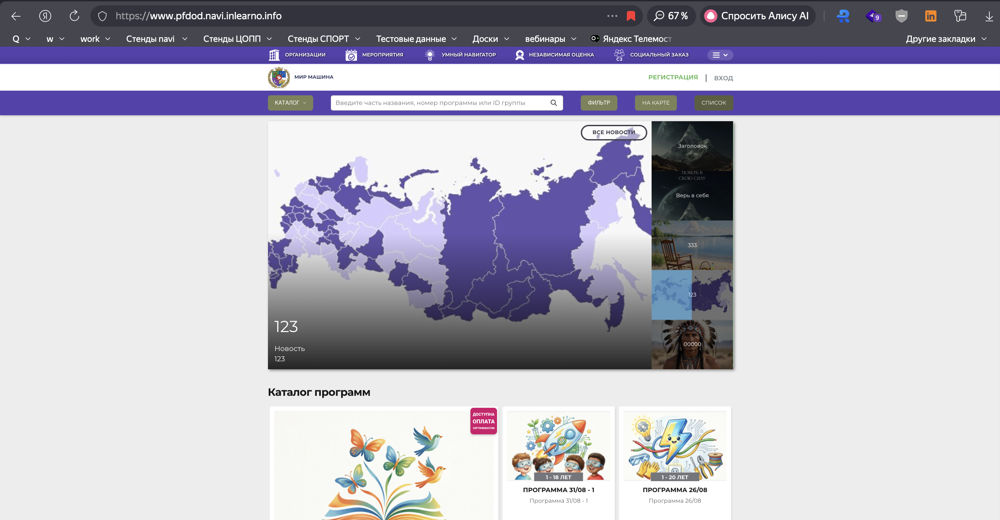
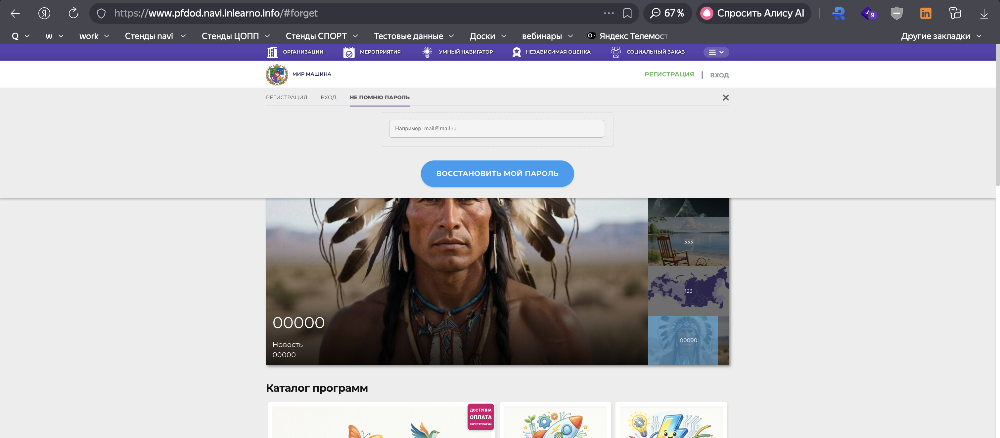

# TC-004: Восстановление пароля: запрос для несуществующего email (сайт)

## Описание
Негативное тестирование восстановления пароля на **публичном** сайте навигатора дополнительного образования.
Проверка поведения системы при вводе email, который не зарегистрирован в системе.

## Предусловия
1. Выйти из аккаунта на сайте, если авторизован.
2. Находиться на главной странице сайта https://www.{СТЕНД}.navi.inlearno.info
3. Подготовить email, который **не** используется ни одним аккаунтом на стенде.

## Шаги

### Шаг 1
**Действие:**
На главной странице сайта нажать кнопку "ВХОД".

**Ожидаемый результат:**
Открывается модальное окно авторизации с вкладками "РЕГИСТРАЦИЯ", "ВХОД" и ссылкой/вкладкой восстановления пароля.

### Шаг 2
**Действие:**
Перейти на вкладку "НЕ ПОМНЮ ПАРОЛЬ".

**Ожидаемый результат:**
Открывается форма восстановления пароля с полем email (плейсхолдер "Например, mail@mail.ru") и кнопкой "ВОССТАНОВИТЬ МОЙ ПАРОЛЬ". URL содержит `#forget`.

### Шаг 3
**Действие:**
- В поле email: ввести несуществующий EMAIL из таблицы параметров
- Нажать кнопку "ВОССТАНОВИТЬ МОЙ ПАРОЛЬ"

**Ожидаемый результат:**
1. Новый пароль **не** отправляется.
2. Отображается сообщение об ошибке: пользователь с указанным email не найден / восстановление невозможно.
3. Пользователь остается неавторизованным, форма восстановления пароля остается открытой.

## Общий ожидаемый результат
Система не восстанавливает пароль для email, отсутствующего в базе, и показывает ошибку без отправки письма.

## Параметры (data-driven)
| Параметр | Значение |
|----------|----------|
| Email | test+99999@example.com |
