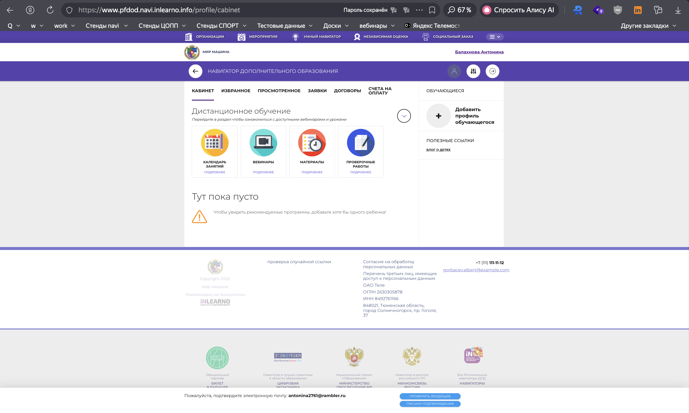

# NAVI2E-1: Сайт. Регистрация. Создание аккаунта с валидными данными

| Параметр | Значение |
|---|---|
| **Приоритет** | High |
| **Серьезность** | Critical |
| **Статус** | Actual |
| **Тип** | Smoke |
| **Автоматизация** | Automated |
| **Роль** | Неавторизованный пользователь |
| **Тестовые планы** | Смоук Сайта НАВИ, Смоук-набор перед релизом |

## Что изменено
- Шаги разбиты на атомарные (открытие формы, валидация, XSS, заполнение, согласия, отправка, закрытие уведомления).
- Добавлены URL стенда, названия элементов UI, таблица тестовых данных.
- Добавлены проверки: обязательность, граничные значения пароля, XSS, сообщения об ошибках.
- Скриншоты привязаны к `screenshots/registration/`.

## Описание
Позитивное тестирование регистрации на **публичном** сайте навигатора дополнительного образования (Mobile First). Дополнительно проверяется, что форма не принимает небезопасные и невалидные данные до успешной отправки.

## Предусловия
1. Открыть публичный сайт: `https://www.{СТЕНД}.navi.inlearno.info`.
2. Выйти из аккаунта, если пользователь авторизован.
3. Подготовить уникальный email вида `test+{число}@example.com` (генератор: https://randomdatatools.ru/).
4. Email не должен быть зарегистрирован на стенде.

## Шаги

### Шаг 1
**Действие:**
Перейти на публичный сайт (поддомен `www`) и нажать кнопку «РЕГИСТРАЦИЯ».

**Ожидаемый результат:**
Открывается форма регистрации. Чекбоксы согласий **выключены**, кнопка отправки формы регистрации **неактивна**.

### Шаг 2
**Действие:**
Оставить обязательные поля пустыми и убедиться, что кнопка отправки недоступна (при необходимости снять фокус с полей).

**Ожидаемый результат:**
Кнопка отправки остаётся **неактивной**. Для пустых обязательных полей отображаются сообщения об ошибке (обязательность / «Укажите корректное значение»). XSS и скрипты не выполняются.

### Шаг 3
**Действие:**
В поле ФИО ввести XSS-строку ``, в поле пароля — значение короче 8 символов (например `Test1`).

**Ожидаемый результат:**
1. Скрипт **не** выполняется, разметка не интерпретируется как HTML.
2. Пароль не проходит граничную проверку (минимум 8 символов, буквы + цифры).
3. Кнопка отправки **неактивна** либо отображается понятное сообщение об ошибке.

### Шаг 4
**Действие:**
Очистить поля и заполнить их валидными значениями из таблицы параметров (генератор: https://randomdatatools.ru/).

**Ожидаемый результат:**
Поля принимают данные, визуально проходят валидацию (без красной рамки). Кнопка отправки пока **неактивна**, пока не включены согласия.

### Шаг 5
**Действие:**
Включить чекбоксы согласия с политикой конфиденциальности и согласия на обработку персональных данных.

**Ожидаемый результат:**
Кнопка отправки формы регистрации становится **активной**.

### Шаг 6
**Действие:**
Нажать кнопку отправки формы регистрации.

**Ожидаемый результат:**
Появляется уведомление об успешной регистрации с кнопкой согласия. Пользователь авторизован на сайте.

### Шаг 7
**Действие:**
Нажать кнопку согласия в окне уведомления об успешной регистрации.

**Ожидаемый результат:**
Уведомление закрывается. В шапке вместо «РЕГИСТРАЦИЯ» / «ВХОД» отображается ФИО нового пользователя.

## Общий ожидаемый результат
Новый пользователь зарегистрирован с валидными данными и автоматически авторизован. Невалидные, пустые и XSS-данные не приводят к успешной регистрации и не исполняются в UI.

## Критерии приемки
- [ ] Форма открывается с неактивной кнопкой отправки и выключенными чекбоксами.
- [ ] Пустые обязательные поля блокируют отправку и показывают сообщения об ошибке.
- [ ] XSS в текстовых полях не исполняется.
- [ ] Пароль короче 8 символов не принимается.
- [ ] После валидного заполнения и согласий регистрация успешна, пользователь авторизован.
- [ ] На мобильной ширине форма и уведомление читаемы (Mobile First).

## Параметры (data-driven)
| Поле | Тип | Валидное значение | Негатив / граница |
|------|-----|-------------------|-------------------|
| ФИО | Строка (кириллица) | Иванов Иван Иванович | `` |
| Email | Email | test+001@example.com | `not-an-email` |
| Телефон | Телефон | +7 (999) 123-45-67 | пусто |
| Пароль | Пароль (≥8, буквы+цифры) | Test1234 | `Test1` (7 символов) |
