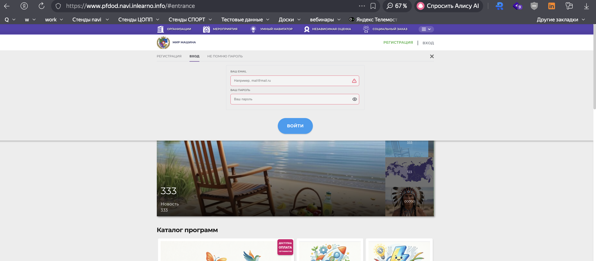
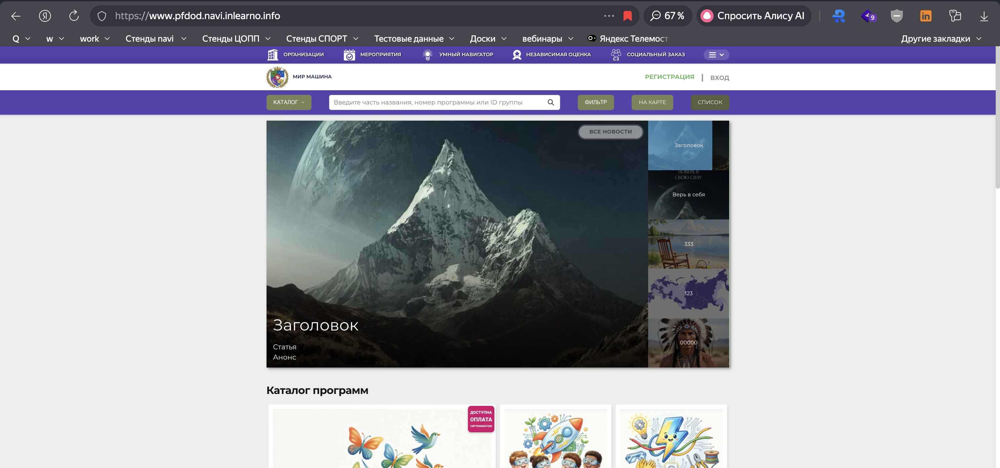

# NAVI2E-6: Авторизация: успешный вход с корректными логином и паролем (сайт)

| Параметр | Значение |
|---|---|
| **Приоритет** | High |
| **Серьезность** | Critical |
| **Статус** | Actual |
| **Тип** | Smoke |
| **Автоматизация** | To be automated |
| **Роль** | Неавторизованный пользователь (есть подтверждённый аккаунт) |
| **Тестовые планы** | Смоук Сайта НАВИ, Смоук-набор перед релизом |

## Что изменено
- Приоритет/серьёзность подняты до High/Critical (вход — критический smoke-сценарий).
- Автоматизация: `To be automated` (в выгрузке Not automated; позитивный вход пригоден к автотестам).
- Шаги атомарные: открытие модалки, пустые поля, XSS/неверный пароль, успешный вход.
- Добавлены названия вкладок и полей, URL `{СТЕНД}`.
- Скриншоты: `screenshots/authorization/` + placeholder для ошибки.

## Описание
Позитивное тестирование авторизации на публичном сайте. Дополнительно проверяется, что пустые поля, XSS и неверный пароль не открывают сессию.

## Предусловия
1. Иметь подтверждённый аккаунт (если нет — NAVI2E-1).
2. Запомнить email и пароль.
3. Выйти из аккаунта, если авторизован.
4. Находиться на `https://www.{СТЕНД}.navi.inlearno.info`.

## Шаги

### Шаг 1
**Действие:**
Нажать «ВХОД» в правом верхнем углу.

**Ожидаемый результат:**
Открывается модальное окно с вкладками «РЕГИСТРАЦИЯ», «ВХОД», «НЕ ПОМНЮ ПАРОЛЬ». Активна «ВХОД». Поля: «Ваш EMAIL», «Ваш ПАРОЛЬ». Кнопка «ВОЙТИ» неактивна, пока поля пустые.

### Шаг 2
**Действие:**
Не заполняя поля, убедиться в состоянии кнопки «ВОЙТИ». При возможности инициировать отправку пустой формы.

**Ожидаемый результат:**
Вход не выполняется. Кнопка неактивна и/или под полями есть сообщения об обязательности.

### Шаг 3
**Действие:**
В «Ваш EMAIL» ввести ``, в «Ваш ПАРОЛЬ» — произвольную строку. Нажать «ВОЙТИ», если кнопка активна.

**Ожидаемый результат:**
Скрипт не выполняется. Авторизация не проходит. Отображается ошибка формата email или неверных учётных данных. Модальное окно остаётся открытым.

### Шаг 4
**Действие:**
Ввести валидный email из предусловия и **неверный** пароль (например `Wrong1234`). Нажать «ВОЙТИ».

**Ожидаемый результат:**
Вход не выполняется. Показано сообщение о неверных учётных данных. Пользователь остаётся неавторизованным (кнопки «РЕГИСТРАЦИЯ» и «ВХОД» на месте).

### Шаг 5
**Действие:**
Ввести email и пароль из предусловия. Нажать «ВОЙТИ».

**Ожидаемый результат:**
1. Модальное окно закрывается.
2. Пользователь на главной (или в кабинете — по текущему UX стенда).
3. В шапке вместо «РЕГИСТРАЦИЯ» / «ВХОД» отображается ФИО.
4. Сессия авторизована.

## Общий ожидаемый результат
Успешный вход с валидными данными. Пустая форма, XSS и неверный пароль не создают сессию и показывают проверяемые ошибки.

## Критерии приемки
- [ ] Модалка входа содержит актуальные вкладки и подписи полей.
- [ ] Пустые поля не дают войти.
- [ ] XSS в email не исполняется.
- [ ] Неверный пароль отклоняется без авторизации.
- [ ] Валидные данные авторизуют пользователя, в шапке видно ФИО.

## Параметры (data-driven)
| Параметр | Значение |
|----------|----------|
| Email | test+001@example.com |
| Пароль | Test1234 |
| Неверный пароль | Wrong1234 |
| XSS | `` |
