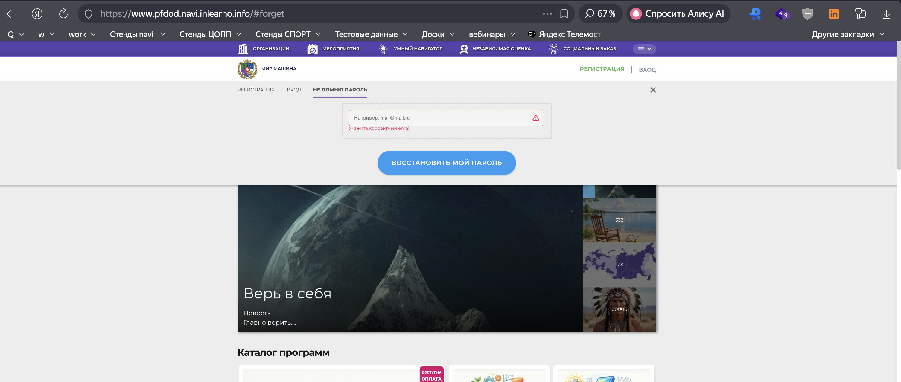
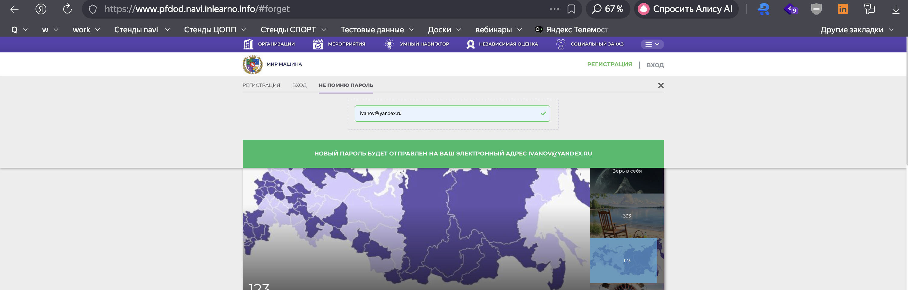

# NAVI2E-7: Восстановление пароля: отправка нового пароля на email (сайт)

| Параметр | Значение |
|---|---|
| **Приоритет** | Medium |
| **Серьезность** | Major |
| **Статус** | Actual |
| **Тип** | Other |
| **Автоматизация** | Not automated |
| **Роль** | Неавторизованный пользователь (есть подтверждённый аккаунт) |
| **Тестовые планы** | Смоук Сайта НАВИ |

## Что изменено
- Заголовок: в UI это **отправка нового пароля**, а не ссылка для сброса (вкладка «НЕ ПОМНЮ ПАРОЛЬ», кнопка «ВОССТАНОВИТЬ МОЙ ПАРОЛЬ»).
- Шаги атомарные: открытие формы, пустое поле, XSS/невалидный email, успех, Stubmails, вход со новым паролем.
- Добавлена проверка, что старый пароль больше не подходит.
- Скриншоты: `screenshots/forgot_password/`.

## Описание
Полный цикл восстановления пароля на публичном сайте: запрос → письмо с новым паролем (Stubmails) → вход. Негатив: пустое поле, невалидный формат, XSS.

## Предусловия
1. Иметь подтверждённый аккаунт (NAVI2E-1).
2. Запомнить email и **текущий** пароль.
3. Выйти из аккаунта.
4. Находиться на `https://www.{СТЕНД}.navi.inlearno.info`.
5. Иметь доступ к Stubmails для ящика тестового пользователя.

## Шаги

### Шаг 1
**Действие:**
Нажать «ВХОД», затем вкладку «НЕ ПОМНЮ ПАРОЛЬ».

**Ожидаемый результат:**
Активна вкладка «НЕ ПОМНЮ ПАРОЛЬ». Форма: поле email (плейсхолдер «Например, mail@mail.ru»), кнопка «ВОССТАНОВИТЬ МОЙ ПАРОЛЬ». URL содержит `#forget`.

### Шаг 2
**Действие:**
Оставить email пустым. Нажать «ВОССТАНОВИТЬ МОЙ ПАРОЛЬ».

**Ожидаемый результат:**
Письмо не отправляется. Поле красное, текст: «Укажите корректный email».

### Шаг 3
**Действие:**
Ввести `not-an-email` и `` (по очереди). Каждый раз нажать «ВОССТАНОВИТЬ МОЙ ПАРОЛЬ».

**Ожидаемый результат:**
XSS не выполняется. Формат отклоняется сообщением «Укажите корректный email». Уведомление об отправке пароля не появляется.

### Шаг 4
**Действие:**
Ввести валидный email из предусловия. Нажать «ВОССТАНОВИТЬ МОЙ ПАРОЛЬ».

**Ожидаемый результат:**
Зелёное уведомление: «НОВЫЙ ПАРОЛЬ БУДЕТ ОТПРАВЛЕН НА ВАШ ЭЛЕКТРОННЫЙ АДРЕС {EMAIL}». Пользователь не авторизован.

### Шаг 5
**Действие:**
Открыть Stubmails, найти письмо по email пользователя (ожидание до 2 минут).

**Ожидаемый результат:**
Письмо получено. В теле — новый пароль (не ссылка сброса, если иное не подтвердит аналитик).

### Шаг 6
**Действие:**
На сайте нажать «ВХОД», ввести email и **старый** пароль. Нажать «ВОЙТИ».

**Ожидаемый результат:**
Вход не выполняется. Показана ошибка неверных учётных данных.

### Шаг 7
**Действие:**
Ввести email и **новый** пароль из письма. Нажать «ВОЙТИ».

**Ожидаемый результат:**
Модалка закрывается. В шапке — ФИО. Сессия с новым паролем активна.

## Общий ожидаемый результат
Новый пароль приходит на email, старый перестаёт работать, вход с новым паролем успешен. Пустой/невалидный/XSS email не инициирует отправку.

## Критерии приемки
- [ ] Форма `#forget` и тексты кнопок совпадают с UI.
- [ ] Пустой и невалидный email: «Укажите корректный email», XSS не исполняется.
- [ ] Успех: зелёное уведомление с адресом.
- [ ] Письмо в Stubmails содержит новый пароль.
- [ ] Вход только с новым паролем.

## Параметры (data-driven)
| Параметр | Значение |
|----------|----------|
| Email | test+001@example.com |
| Невалидный email | not-an-email |
| XSS | `` |
