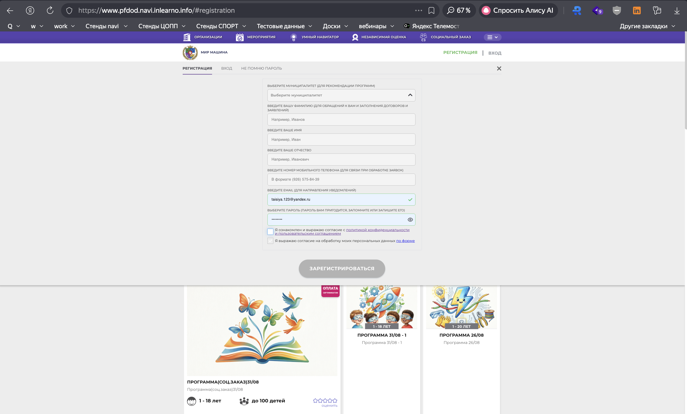
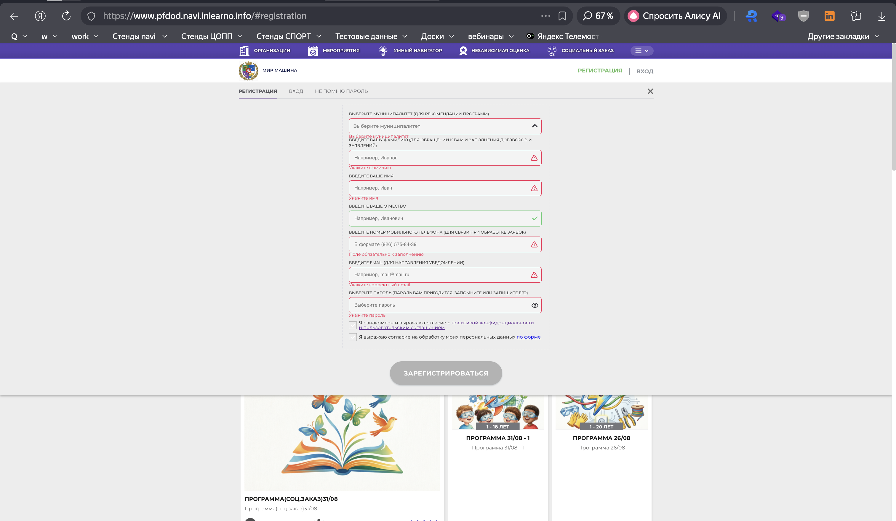
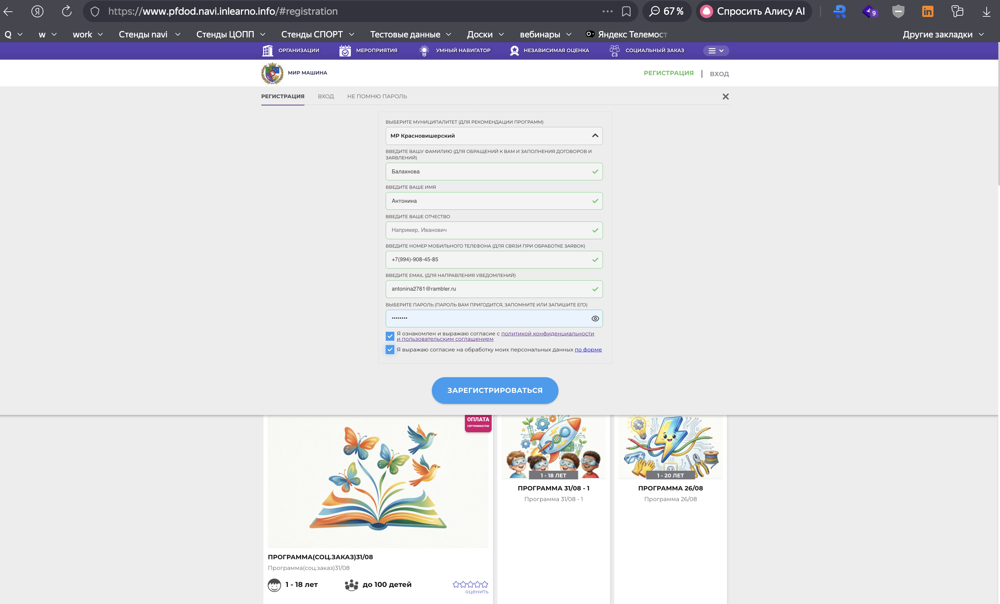
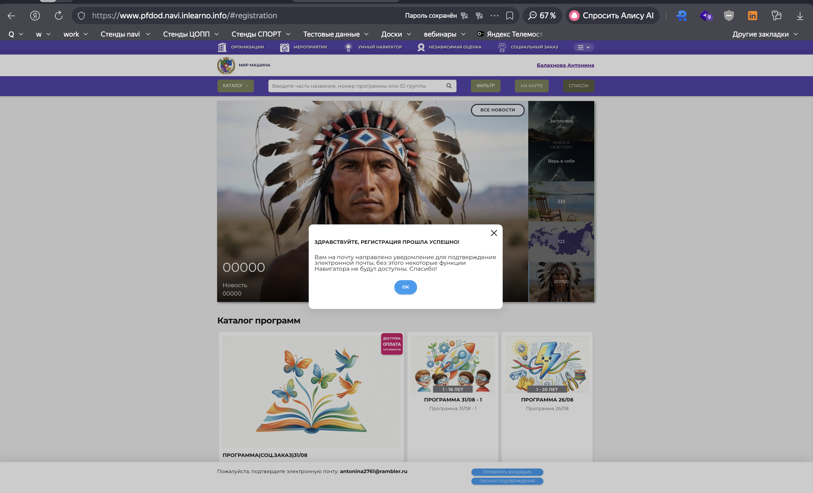

# NAVI2E-8: Регистрация: ошибки при незаполненных обязательных полях (сайт)

| Параметр | Значение |
|---|---|
| **Приоритет** | Medium |
| **Серьезность** | Major |
| **Статус** | Actual |
| **Тип** | Smoke |
| **Автоматизация** | Not automated |
| **Роль** | Неавторизованный пользователь |
| **Тестовые планы** | Смоук Сайта НАВИ |

## Что изменено
- Приоритет/серьёзность: Low/Minor → Medium/Major (валидация регистрации — блокер дыр в данных).
- Шаги атомарные; тексты ошибок вынесены в проверяемый список.
- Добавлены XSS, граничные значения пароля, спецсимволы в ФИО.
- Успешная регистрация в конце оставлена как проверка, что после исправления ошибок форма живая (не дублировать NAVI2E-1 как основную цель).
- Скриншоты: `screenshots/registration/`.

## Описание
Клиентская валидация формы регистрации: пустые обязательные поля, частичное заполнение, согласия, некорректный формат, XSS. После исправления — успешная отправка.

## Предусловия
1. Пользователь не авторизован.
2. Главная: `https://www.{СТЕНД}.navi.inlearno.info`.
3. Подготовить уникальный валидный набор данных (https://randomdatatools.ru/, email `test+{число}@example.com`).

## Шаги

### Шаг 1
**Действие:**
Нажать «РЕГИСТРАЦИЯ» в правом верхнем углу.

**Ожидаемый результат:**
Модалка регистрации. Кнопка «ЗАРЕГИСТРИРОВАТЬСЯ» неактивна. Поля пустые, чекбоксы согласий сняты.

### Шаг 2
**Действие:**
Попытаться нажать «ЗАРЕГИСТРИРОВАТЬСЯ» без заполнения полей.

**Ожидаемый результат:**
Нажатие не отправляет форму. Если валидация видна — сообщения:
- Муниципалитет: «Выберите муниципалитет»
- Фамилия: «Укажите фамилию»
- Имя: «Укажите имя»
- Телефон: «Поле обязательно к заполнению»
- Email: «Укажите корректный email»
- Пароль: «Укажите пароль»

### Шаг 3
**Действие:**
Заполнить только ФИО (кириллица), остальные обязательные поля оставить пустыми, снять фокус с полей.

**Ожидаемый результат:**
Кнопка «ЗАРЕГИСТРИРОВАТЬСЯ» неактивна. У ФИО нет ошибок. У пустых обязательных полей — ошибки (если валидация по blur).

### Шаг 4
**Действие:**
Заполнить все обязательные поля валидными данными. Чекбоксы согласий **не** отмечать.

**Ожидаемый результат:**
Кнопка «ЗАРЕГИСТРИРОВАТЬСЯ» остаётся неактивной.

### Шаг 5
**Действие:**
Отметить оба чекбокса: политика конфиденциальности / пользовательское соглашение; согласие на обработку ПДн.

**Ожидаемый результат:**
Кнопка «ЗАРЕГИСТРИРОВАТЬСЯ» активна (меняется цвет).

### Шаг 6
**Действие:**
Подменить значения: Email `testmail.ru`, Телефон `абвгдеж`, Пароль `12`, Фамилия ``. Нажать «ЗАРЕГИСТРИРОВАТЬСЯ», если активна.

**Ожидаемый результат:**
Форма не отправляется, XSS не выполняется. Подсказки:
- Email: «Укажите корректный email»
- Телефон: «В формате (926) 575-84-39» (или актуальная маска стенда)
- Пароль: требование минимальной длины (≥8) и состава
- Фамилия: кириллица / недопустимые символы

### Шаг 7
**Действие:**
Исправить все поля по таблице валидных значений, согласия включены. Нажать «ЗАРЕГИСТРИРОВАТЬСЯ».

**Ожидаемый результат:**
Форма отправляется. Уведомление об успешной регистрации (и/или подтверждении email). Скрипт из шага 6 в UI не исполняется.

## Общий ожидаемый результат
Обязательность, форматы, согласия и XSS отрабатывают предсказуемо. После исправления ошибок регистрация возможна.

## Критерии приемки
- [ ] Пустая форма не отправляется, кнопка неактивна.
- [ ] Частичное заполнение не активирует кнопку.
- [ ] Без чекбоксов кнопка неактивна.
- [ ] Невалидные email/телефон/пароль и XSS отклоняются с понятными сообщениями.
- [ ] После исправления регистрация успешна.

## Параметры (data-driven)
| Поле | Валидное | Негатив / граница |
|------|----------|-------------------|
| Муниципалитет | значение из списка | пусто |
| Фамилия / Имя | Иванов / Иван | пусто, `` |
| Телефон | +7 (999) 123-45-67 | `абвгдеж` |
| Email | test+008@example.com | `testmail.ru` |
| Пароль | Test1234 | `12` |
