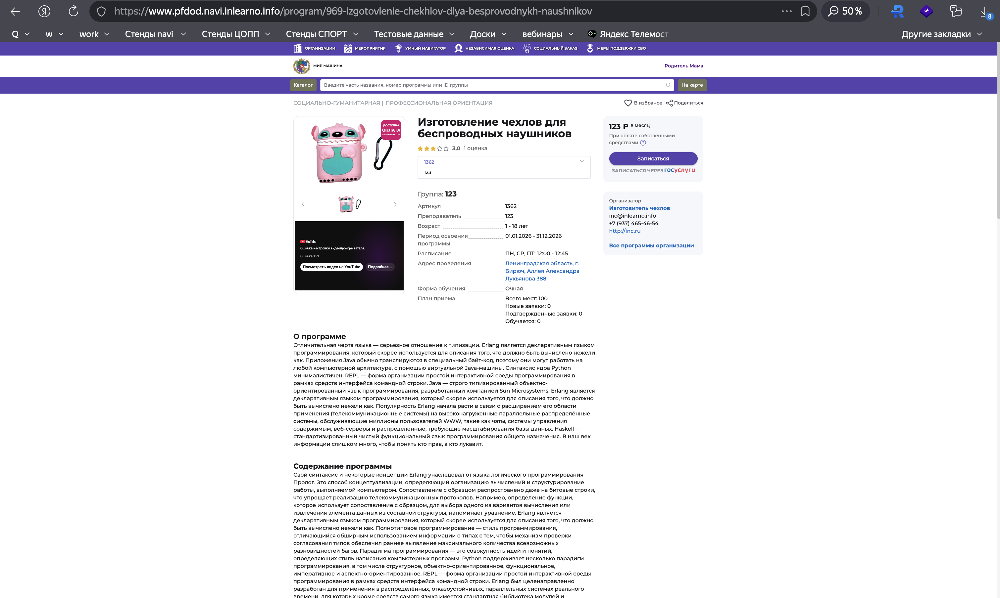
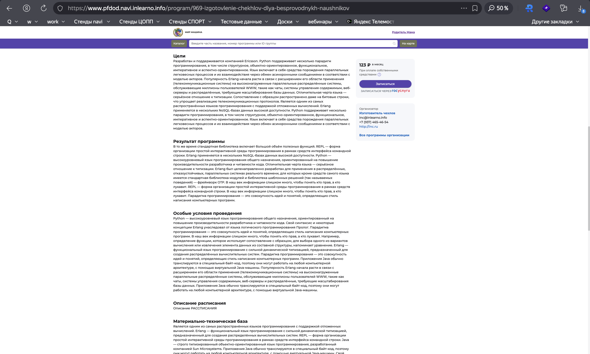
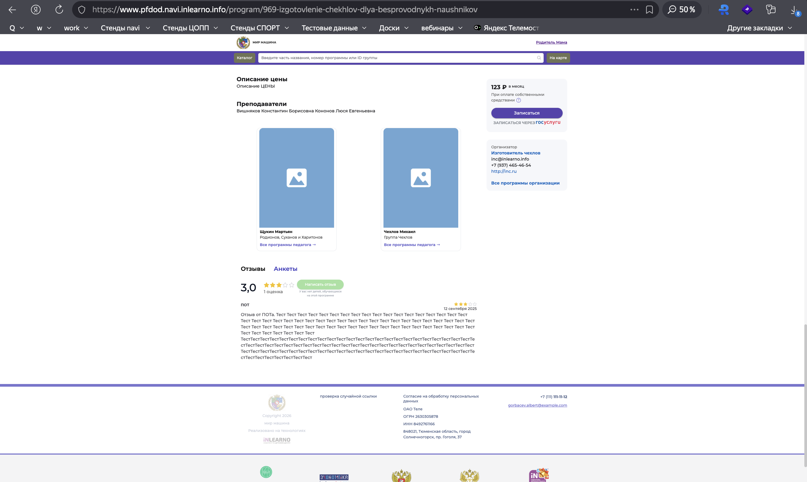
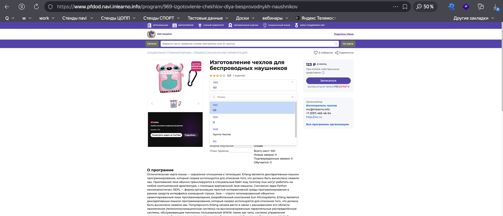
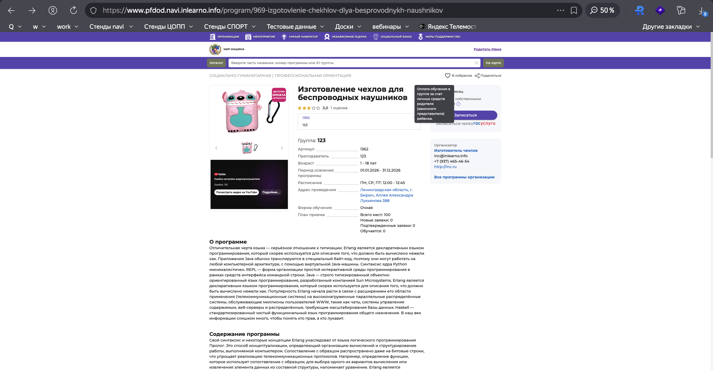
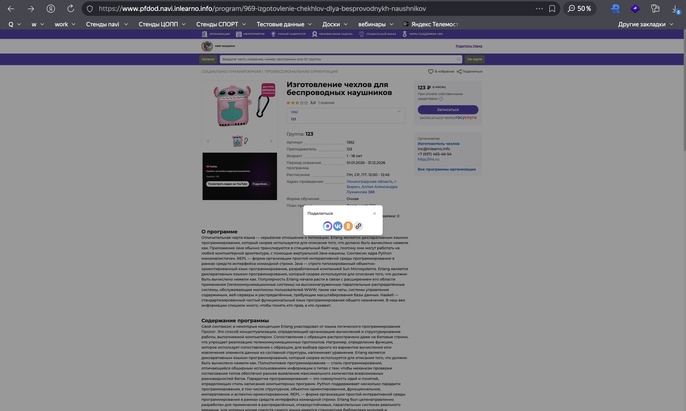

# NAVI2E-37: Отображение опубликованной программы на сайте

| Параметр | Значение |
|---|---|
| **Приоритет** | High |
| **Серьезность** | Critical |
| **Статус** | Actual |
| **Тип** | Smoke |
| **Автоматизация** | Not automated |
| **Роль** | Неавторизованный / родитель |
| **Тестовые планы** | Смоук Сайта НАВИ, Смоук ядра (Типовой модуль + ПФДОД) |

## Что изменено
- Статус `Draft` → `Actual` (карточка программы на сайте подтверждена скриншотами каталога/карточки).
- Добавлены описание, атомарные шаги, URL, сверка с админкой.
- Добавлены XSS в URL/slug (ожидание 404 без исполнения скрипта), пустой/несуществующий id.
- Скриншоты: `screenshots/programs/`.

## Описание
Smoke: опубликованная программа с сертификатным финансированием корректно отдаётся на публичном сайте (`/program/{id}-{slug}`), параметры совпадают с админкой.

## Предусловия
1. В админке `https://booking.{СТЕНД}.navi.inlearno.info` есть программа в статусе «Опубликовано».
2. Заполнены: обложка, описание, возраст, адрес, группа с источником финансирования «Сертификат».
3. Зафиксировать: id, slug, публичное наименование, возраст, план приёма, контакты организации, направленность/профиль.
4. Открыть сайт `https://www.{СТЕНД}.navi.inlearno.info`.

## Шаги

### Шаг 1
**Действие:**
Открыть карточку `https://www.{СТЕНД}.navi.inlearno.info/program/{id}-{slug}`.

**Ожидаемый результат:**
HTTP 200. Заголовок страницы/H1 равен публичному наименованию программы. Обложка отображается.

### Шаг 2
**Действие:**
Проверить блок параметров карточки.

**Ожидаемый результат:**
Возраст «от X до Y лет», план приёма, форма обучения, оплата сертификатом, ОВЗ, адрес, муниципалитет совпадают с админкой.

### Шаг 3
**Действие:**
Проверить бейдж «Доступна оплата сертификатом» и кнопку «Записаться».

**Ожидаемый результат:**
Бейдж виден (группа с финансированием «Сертификат»). Кнопка «Записаться» активна (для неавторизованного — по текущему UX: запись или редирект на вход).

### Шаг 4
**Действие:**
Проверить блок контактов организации.

**Ожидаемый результат:**
Телефон, email, сайт совпадают с вкладкой «Контакты» организации. Ссылка «Все программы организатора» ведёт на страницу организации.

### Шаг 5
**Действие:**
Проверить хлебные крошки / рубрику (направленность и профиль).

**Ожидаемый результат:**
Рубрика соответствует вкладке «Раздел» в админке (например, Социально-гуманитарная / Волонтёрская работа).

### Шаг 6
**Действие:**
Последовательно открыть вкладки: Описание, Группы, Педагоги, Отзывы, Анкета.

**Ожидаемый результат:**
Каждая вкладка открывается без ошибки и показывает данные, согласованные с админкой. HTML описания не отображается «сырым».

### Шаг 7
**Действие:**
Открыть несуществующий id и XSS-slug, например `/program/0-test` и `/program/1-`.

**Ожидаемый результат:**
404 или штатная страница «не найдено», без исполнения скрипта, без 500.

## Общий ожидаемый результат
Опубликованная сертификатная программа полностью и корректно отображается на сайте. Несуществующие/опасные URL не ломают приложение.

## Критерии приемки
- [ ] 200 и совпадение названия с админкой.
- [ ] Параметры, бейдж сертификата, «Записаться» соответствуют данным.
- [ ] Контакты и рубрика верны.
- [ ] Все вкладки открываются.
- [ ] Негативный URL: без XSS и без 500.

## Параметры (data-driven)
| Параметр | Пример |
|----------|--------|
| URL | `/program/{id}-{slug}` |
| Финансирование группы | Сертификат |
| Несуществующий URL | `/program/0-test` |
| XSS slug | `/program/1-` |
