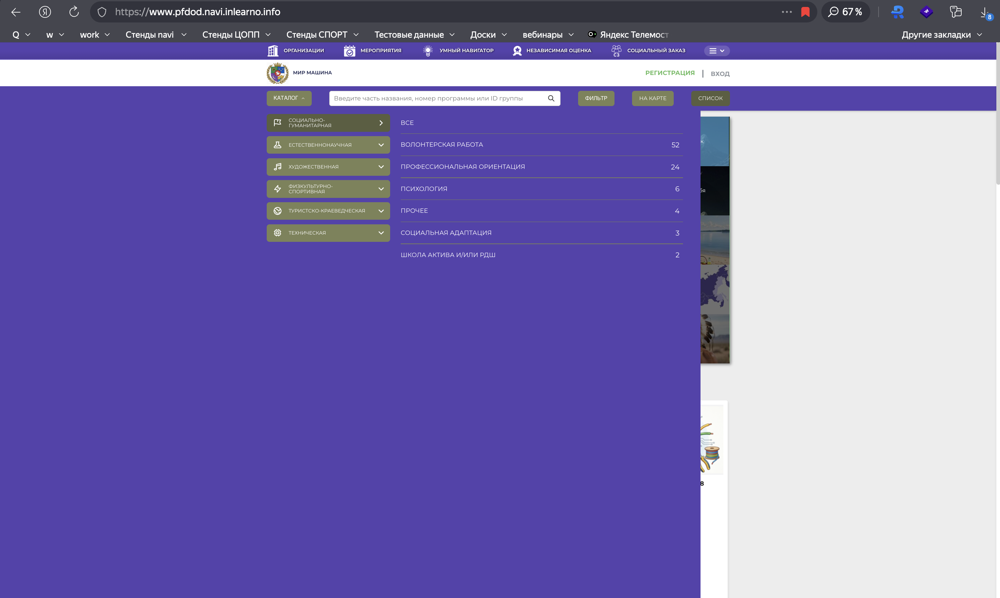
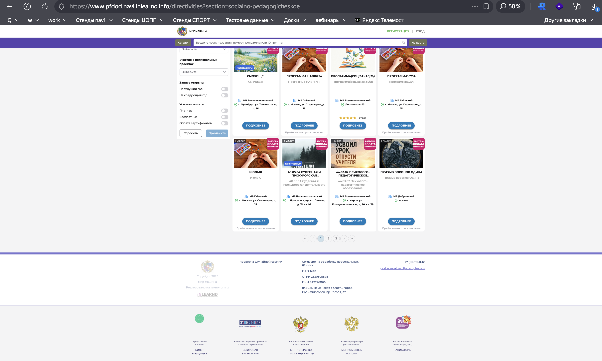

# NAVI2E-38: Поиск программы в каталоге сайта

| Параметр | Значение |
|---|---|
| **Приоритет** | High |
| **Серьезность** | Major |
| **Статус** | Actual |
| **Тип** | Smoke |
| **Автоматизация** | Not automated |
| **Роль** | Неавторизованный пользователь |
| **Тестовые планы** | Смоук Сайта НАВИ, Смоук ядра (Типовой модуль + ПФДОД) |

## Что изменено
- Исправлены формулировки («строек поиска» → «строка поиска»).
- Шаги атомарные: каталог, точное имя, регистр, id, XSS, пустая выдача, черновики.
- Добавлен поиск по id (было в описании, не было в шагах).
- Скриншоты: `screenshots/programs/`.

## Описание
Поиск в каталоге публичного сайта: опубликованные программы по названию (без учёта регистра) и по id. Черновики и модерация в выдачу не попадают.

## Предусловия
1. На сайте опубликовано несколько программ разных направленностей.
2. Известны: точное название одной опубликованной программы, её id, одно слово из названия.
3. Есть программа-черновик и/или «на модерации» с уникальным названием (не должно находиться).
4. Сайт: `https://www.{СТЕНД}.navi.inlearno.info`.

## Шаги

### Шаг 1
**Действие:**
Открыть каталог программ на публичном сайте.

**Ожидаемый результат:**
Виден рубрикатор направленностей (Социально-гуманитарная, Техническая и др.) со счётчиками. Есть строка поиска (плейсхолдер вроде «Введите часть названия, номер программы или ID группы»).

### Шаг 2
**Действие:**
Ввести точное название опубликованной программы. Применить поиск (Enter / кнопка).

**Ожидаемый результат:**
Программа есть в результатах. Карточка кликабельна.

### Шаг 3
**Действие:**
Очистить поиск. Ввести часть названия в другом регистре.

**Ожидаемый результат:**
Поиск регистронезависимый, программа в выдаче.

### Шаг 4
**Действие:**
Ввести id опубликованной программы.

**Ожидаемый результат:**
Найдена соответствующая программа (или группа — по фактическому поведению поиска стенда). Посторонние программы не подмешиваются без причины.

### Шаг 5
**Действие:**
Выбрать в рубрикаторе направленность и профиль этой программы.

**Ожидаемый результат:**
Программа в списке профиля. Количество карточек согласовано со счётчиком рубрики.

### Шаг 6
**Действие:**
Ввести заведомо несуществующую строку (например `zzz_no_program_99999`).

**Ожидаемый результат:**
Пустое состояние без ошибок UI: «К сожалению, нам не удалось найти ничего идеально подходящего.»

### Шаг 7
**Действие:**
Ввести XSS `` и строку из 255+ символов.

**Ожидаемый результат:**
Скрипт не выполняется. Нет 500. Либо пустая выдача, либо безопасное экранирование запроса в UI.

### Шаг 8
**Действие:**
Искать уникальное название черновика / программы на модерации.

**Ожидаемый результат:**
В выдаче только опубликованные. Черновик и модерация отсутствуют.

## Общий ожидаемый результат
Поиск находит опубликованные программы по названию и id, игнорирует регистр, корректно показывает пустое состояние, не исполняет XSS и не отдаёт неопубликованные карточки.

## Критерии приемки
- [ ] Каталог и рубрикатор отображаются.
- [ ] Поиск по точному имени, части имени и id работает.
- [ ] Пустой результат — фиксированный текст без ошибок.
- [ ] XSS и длинная строка безопасны.
- [ ] Черновики/модерация не в выдаче.

## Параметры (data-driven)
| Параметр | Пример |
|----------|--------|
| Название | Программа 31/08 - 1 |
| Часть названия (другой регистр) | ПРОГРАММА |
| ID | числовой id из админки |
| Пустой поиск | `zzz_no_program_99999` |
| XSS | `` |
