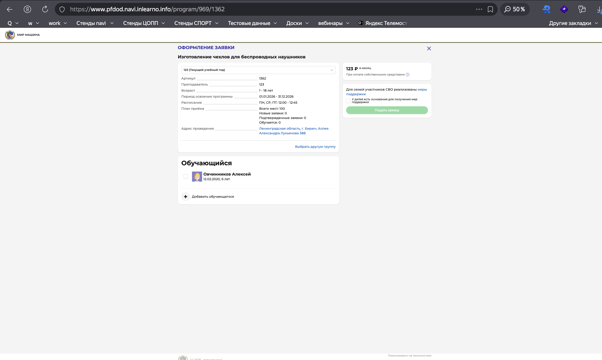
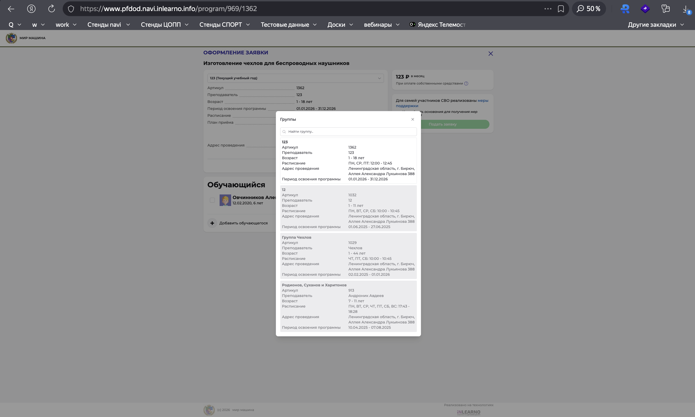
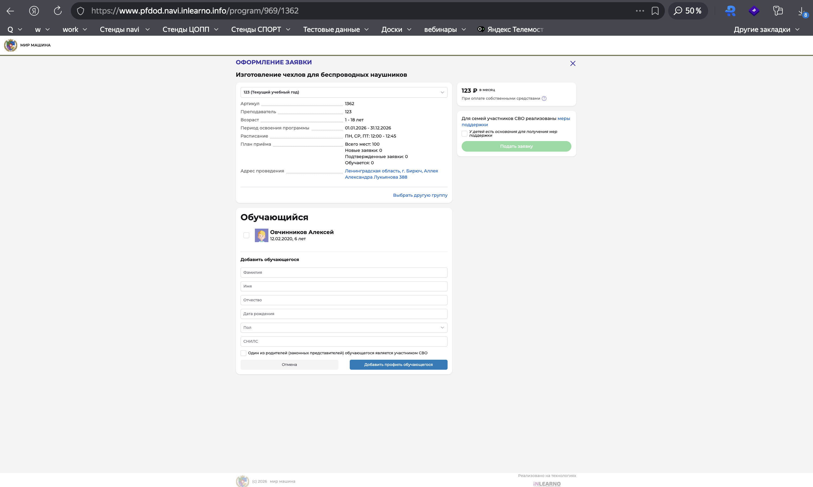

# NAVI2E-39: Подача заявки на программу с сайта

| Параметр | Значение |
|---|---|
| **Приоритет** | High |
| **Серьезность** | Critical |
| **Статус** | Actual |
| **Тип** | Smoke |
| **Автоматизация** | Not automated |
| **Роль** | Родитель (подтверждённый ребёнок) |
| **Тестовые планы** | Смоук Сайта НАВИ, Смоук ядра (Типовой модуль + ПФДОД) |

## Что изменено
- Шаги атомарные: карточка → модалка → отказ без ребёнка → XSS не применим к чекбоксу → подача → ЛК → админка.
- Добавлена негативная проверка: заявка без выбранного обучающегося.
- Госуслуги упомянуты как ссылка на карточке (отдельный кейс интеграции не смешивать).
- Скриншоты: `screenshots/programs/`.

## Описание
Полный цикл записи на программу с публичного сайта: карточка → оформление → подтверждение → заявка в ЛК родителя и в админке.

## Предусловия
1. Авторизоваться на `https://www.{СТЕНД}.navi.inlearno.info` как родитель.
2. В профиле есть минимум один ребёнок с корректной датой рождения, **подтверждённый** в админке («Подтверждён» = Да).
3. Опубликованная программа с активной группой: статус «Опубликовано», приём заявок включён, есть места, возраст группы подходит ребёнку.
4. Запомнить название программы и группы (пример: «Программа 31/08 - 1», «Группа 123»).
5. Доступ в админку заявок: `https://booking.{СТЕНД}.navi.inlearno.info`.

## Шаги

### Шаг 1
**Действие:**
Найти программу в каталоге (поиск/категория) и открыть карточку.

**Ожидаемый результат:**
Страница с названием, артикулом, группой, преподавателем, возрастом, периодом, расписанием, адресом, формой обучения, планом приёма. Кнопка «Записаться» активна. Есть ссылка «Записаться через Госуслуги».

### Шаг 2
**Действие:**
Нажать «Записаться».

**Ожидаемый результат:**
Модалка «ОФОРМЛЕНИЕ ЗАЯВКИ»: программа, группа, детали, стоимость, «Подать заявку», «Выбрать другую группу», блок «Обучающийся» со списком детей, «Добавить обучающегося».

### Шаг 3
**Действие:**
Не выбирая ребёнка, нажать «Подать заявку».

**Ожидаемый результат:**
Заявка не создаётся. Сообщение об ошибке: нужно выбрать обучающегося (обязательность). Редиректа в успех нет.

### Шаг 4
**Действие:**
Отметить чекбокс ребёнка из предусловий. Нажать «Подать заявку».

**Ожидаемый результат:**
Успех: «Заявка принята и будет обработана в ближайшее время.» Красное предупреждение: «Внимание! Настоящая заявка не является фактом зачисления на обучение.» Текст про email и 7 рабочих дней. Кнопка «Да, понятно». Блок «Пригласите друзей…». На email родителя (Stubmails) — уведомление с контактами организатора.

### Шаг 5
**Действие:**
Нажать «Да, понятно». Открыть ЛК родителя: «ЗАЯВКИ» → «История заявок».

**Ожидаемый результат:**
Новая заявка: статус «Новая» (красный), название программы, дата оформления (сегодня), ФИО ребёнка, учебный год, номер заявки, группа. Текст: «Ожидайте, администратор учреждения свяжется с вами в ближайшее время». «Действующих договоров нет». Действия: «ОТМЕНИТЬ», «ОТКРЫТЬ СТРАНИЦУ ПРОГРАММЫ».

### Шаг 6
**Действие:**
В админке открыть «Заявки», отфильтровать по программе.

**Ожидаемый результат:**
Заявка есть: программа, группа, ребёнок, заявитель, дата, статус «Новая». XSS в ФИО ребёнка из профиля не исполняется в гриде (экранирование).

## Общий ожидаемый результат
Заявка создаётся только после выбора обучающегося, отображается в ЛК и админке в статусе «Новая», на почту уходит уведомление. Зачисление автоматически не происходит.

## Критерии приемки
- [ ] «Записаться» открывает модалку с актуальными полями.
- [ ] Без ребёнка заявка не уходит.
- [ ] Успех содержит дисклеймер «не является фактом зачисления».
- [ ] Заявка видна в ЛК и в админке.
- [ ] Письмо приходит в Stubmails (допустима задержка до нескольких минут).

## Параметры (data-driven)
| Параметр | Пример |
|----------|--------|
| Программа | Программа 31/08 - 1 |
| Группа | Группа 123 |
| Ребёнок | подтверждённый, возраст в диапазоне группы |
| Статус заявки | Новая |
