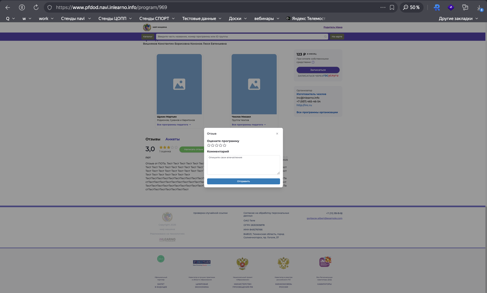

# NAVI2E-44: Отзывы на программу на сайте

| Параметр | Значение |
|---|---|
| **Приоритет** | Medium |
| **Серьезность** | Major |
| **Статус** | Actual |
| **Тип** | Other |
| **Автоматизация** | Not automated |
| **Роль** | Родитель (ребёнок обучается / заявка подтверждена); модерация — администратор |
| **Тестовые планы** | Смоук Сайта НАВИ, Смоук ядра (Типовой модуль + ПФДОД) |

## Что изменено
- Шаги атомарные; вынесена валидация: без оценки, пустой комментарий, XSS, граничная длина.
- Уточнено поведение кнопки «Написать отзыв» после отправки: **проверить факт на стенде** (в исходнике было «уточнить по факту»).
- Цикл модерации в админке сохранён: статус «На модерации» → «Опубликовано» → пересчёт рейтинга.
- Скриншот: `screenshots/programs/program_leave_review.png`.

## Описание
Отправка отзыва с сайта, модерация в админке, появление на карточке и пересчёт рейтинга. Негатив: пустые обязательные поля и XSS.

## Предусловия
1. Авторизоваться на `https://www.{СТЕНД}.navi.inlearno.info` как родитель.
2. Подтверждённый ребёнок обучается на программе (заявка подтверждена или зачисление).
3. Программа опубликована.
4. У этого пользователя ещё нет отзыва на программу (кнопка «Написать отзыв» активна).
5. Доступ в админку, модуль «Отзывы».

## Шаги

### Шаг 1
**Действие:**
Открыть карточку программы, прокрутить до «Отзывы», нажать «Написать отзыв».

**Ожидаемый результат:**
Вкладки «Отзывы» / «Анкеты». Если отзывов нет: рейтинг «0,0», «0 оценок», «Пока нет отзывов». Модалка «Отзыв»: «Оцените программу», 5 пустых звёзд, «Комментарий» (плейсхолдер «Опишите свои впечатления»), «Отправить», «X».

### Шаг 2
**Действие:**
Не выбирая звёзды и не заполняя комментарий, нажать «Отправить».

**Ожидаемый результат:**
Отзыв не уходит. Сообщения обязательности оценки и/или комментария (по правилам стенда). XSS не при чём на этом шаге.

### Шаг 3
**Действие:**
Поставить 4 звезды. В комментарий ввести ``. Нажать «Отправить».

**Ожидаемый результат:**
Либо клиентская блокировка опасной разметки, либо принятие **как текста**. Script не выполняется в модалке. Если отзыв сохранился — в админке и на сайте после публикации текст экранирован.

### Шаг 4
**Действие:**
Закрыть/открыть форму при необходимости. Поставить 4 звезды, комментарий: «Отличная программа, ребёнку понравилось!». Нажать «Отправить».

**Ожидаемый результат:**
«Спасибо, что вы с нами!» / «Отзыв принят и появится на сайте после модерации!», кнопка «Понятно». Публичный рейтинг ещё не меняется.

### Шаг 5
**Действие:**
Нажать «Понятно». Проверить блок «Отзывы» и кнопку «Написать отзыв».

**Ожидаемый результат:**
Модалка закрыта. Неопубликованный отзыв в блоке не виден. Зафиксировать факт: кнопка активна или заблокирована до модерации (оба варианта задокументировать по стенду, без дефекта «наугад»).

### Шаг 6
**Действие:**
В админке → «Отзывы», фильтр по дате, найти запись.

**Ожидаемый результат:**
Текст, оценка 4, дата сегодня, статус не «Опубликовано» (ожидаемо «На модерации»), привязка к программе. XSS-вариант (если прошёл) хранится как текст.

### Шаг 7
**Действие:**
Открыть отзыв, статус «Опубликовано», сохранить. Обновить карточку программы на сайте (F5), блок «Отзывы».

**Ожидаемый результат:**
Отзыв виден: текст, 4 звезды, автор, дата. Средний рейтинг и число оценок пересчитаны. HTML в тексте не исполняется.

## Общий ожидаемый результат
Отзыв уходит на модерацию, на сайте появляется только после «Опубликовано», рейтинг пересчитывается. Пустая форма и XSS не ломают страницу.

## Критерии приемки
- [ ] Форма отзыва открывается с звёздами и комментарием.
- [ ] Пустая отправка блокируется.
- [ ] XSS не исполняется.
- [ ] До публикации рейтинг не меняется.
- [ ] После публикации отзыв и рейтинг на сайте корректны.

## Параметры (data-driven)
| Параметр | Значение |
|----------|----------|
| Оценка | 4 |
| Комментарий | Отличная программа, ребёнку понравилось! |
| XSS | `` |
| Статус до модерации | На модерации |
